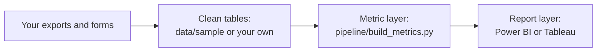

# Custom AMS Dashboards

A free, open template for the screens of an athlete management system (AMS), built in Power BI and Tableau from your own data.

Most commercial athlete management systems show the same core screens: a squad board for the morning, an athlete profile, load, wellness, testing, availability, and data health. This template rebuilds those screens from files you own. You keep your data, you can see every formula, and you change any page you want.

The template comes with made-up sample data for 28 athletes over 13 weeks, so you can open it before you add your own data.

## Who it's for

This template is for coaches, sports scientists, performance analysts, and athletic trainers who:

- Already use Power BI or Tableau, or have access through their organization.
- Have athlete data from wellness forms, session RPE, GPS, or force plates.
- Want their own dashboards instead of, or alongside, a commercial AMS.

You do not need to write code to use the dashboards. One step, the metric layer, runs a Python script. The [setup guide](docs/use-your-own-data.md) shows each command.

## What's inside

The `dashboards` folder is laid out like this:

```text
dashboards/
├── data/
│   ├── sample/          Made-up clean tables: athletes, sessions, measures, availability, settings, import log
│   └── metrics/         The metric layer the dashboards read, built from data/sample
├── pipeline/
│   ├── make_sample_data.py   Makes the sample data
│   ├── build_metrics.py      Calculates every metric once
│   └── tests/                Known-answer tests for the formulas
├── powerbi/             Power BI project: open CustomAMS.pbip
├── tableau/             Tableau workbooks: CustomAMS-staff.twb and CustomAMS-athlete.twb
├── scripts/             Build and check the Power BI and Tableau files
└── docs/                Setup guides
```

## The screens

Both tools show these screens:

| Screen | What it shows | Who reads it |
|---|---|---|
| Squad board | One row for each athlete on the chosen day: availability, morning form, wellness against the athlete's usual, acute and chronic load, and the latest jump test against measurement error | Coaches and sports scientists |
| Athlete profile | Daily load with 7-day and 28-day mean load, jump height against the noise band, and the last 28 days of wellness answers | Sports scientists |
| Load | Weekly session RPE load for each athlete, with the number of complete days | Sports scientists |
| Wellness and check-ins | A grid of athletes by days, colored by the total wellness z-score, and form completion by day | Sports scientists |
| Testing | Change in jump height from baseline for each athlete, with the noise band and the number of flags expected by chance | Sports scientists and strength coaches |
| Availability | Athletes who are full, modified, or out each day | Coaches |
| Data health | The import log, form and rating completion, and device failures | The person who runs the AMS |
| My data | The athlete's own jump height and wellness against their own usual range, in plain words | Athletes |

The Power BI version has a date slicer on the squad board. The Tableau version shows the latest day. In Tableau, the **My data** screen is a separate workbook, so athletes never open a staff workbook or its athlete list.

## How it works

Data moves through four layers, always in the same direction:



Every metric is calculated once, in `pipeline/build_metrics.py`. Power BI and Tableau only look values up, filter, and draw. That keeps one formula in one place, and lets you check every number on a screen against a file.

The metric layer uses the methods in the skills in this repository. See [`docs/calculations.md`](../docs/calculations.md):

| Metric | Method |
|---|---|
| Session RPE load | Rating on the CR-10 scale times minutes. A session with no rating gives a missing day, not 0. |
| Acute and chronic load | Mean daily load over 7 and 28 days. A window with any missing day gives no value. |
| ACWR | Rolling coupled 7:28, shown with this sentence: ACWR describes how recent load compares with longer-term load. It does not predict injury. |
| Wellness z-score | Today's total against the athlete's previous answers in the last 28 days, with at least 14 answers. Today is left out of the baseline. |
| Jump change state | The change from the athlete's baseline mean, against the noise band `t × TE × √(1 + 1/n)` and the smallest worthwhile change. The typical error (TE) comes from a preseason retest. |

The tests in `pipeline/tests` check these formulas against the worked examples in [`docs/calculations.md`](../docs/calculations.md).

## Try it with the sample data

The `data/metrics` folder already holds the metric layer for the sample data.

- **Power BI:** open `powerbi/CustomAMS.pbip` in Power BI Desktop, set the `DataFolder` parameter to your copy of `data/metrics`, and refresh. See [Open the template in Power BI](docs/power-bi.md).
- **Tableau:** open `tableau/CustomAMS-staff.twb` in Tableau Desktop or the free Tableau Desktop Public Edition. If Tableau asks for a file, browse to `data/metrics`. See [Open the template in Tableau](docs/tableau.md).

## Use your own data

Put your data in the clean table layout, run the metric layer, then refresh the dashboards. See [Use your own data](docs/use-your-own-data.md).

## Show athletes only their own data

Both versions include row-level security for the **My data** screen. Each athlete signs in and sees only their own rows. It works only after you publish to the Power BI service, Tableau Server, or Tableau Cloud under your organization's account. See the setup guide for each tool.

Never publish athlete data to Tableau Public or with Power BI **Publish to web**. Both make the data public.

## What was checked

These checks ran on the files in this folder:

- The metric layer passes 14 known-answer tests, including the ACWR and wellness z-score worked examples from [`docs/calculations.md`](../docs/calculations.md). GitHub runs these tests on every push and pull request.
- Every Power BI JSON file passes Microsoft's published schemas, every field a visual uses exists in the model, and every DAX reference names a real column or measure. See [Check the template](docs/check-the-template.md).
- Both Tableau workbooks pass the official Tableau workbook schemas for 2026.1 and 2026.2, and every field a sheet uses exists in its data source.

These checks catch the mistakes that stop a file from opening. They do not prove that every page looks right. The project has not yet been opened in Power BI Desktop or Tableau Desktop. If a page does not open or looks wrong, please [open an issue](CONTRIBUTING.md).

## What the template does not do

The dashboards support your decisions. They do not make them. The template does not:

- Diagnose injuries, predict injury risk, or clear an athlete to return to sport.
- Hold medical records. Keep those in a product approved for medical records.
- Replace an athlete phone app. The check-in forms run in a form tool your organization approves. See the [`ams-dashboards`](../skills/ams-dashboards/) skill.

Check every result before you act on it. Nothing in this repository is legal or medical advice.

## License

Documentation uses the CC BY 4.0 license. Code uses the MIT license. See [LICENSE.md](LICENSE.md).

