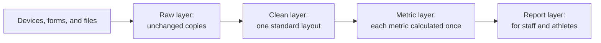

# Plan and build your own athlete management system

Last checked: 2026-10-05

This guide shows you how to plan an athlete management system (AMS) that you build and run yourself, and how to start it small. It covers the parts of the system, whether to buy or build, which tools to use, where to host it, how to lay it out, how to bring data in, who should see what, and how to keep it running when staff change.

The guide is for coaches, sports scientists, performance analysts, and athletic trainers. You do not need to write code. Each section links to a detailed reference file in the [`ams-architecture`](../skills/ams-architecture/) skill. Your AI tool reads the same files when you install the skill.

This guide is not legal advice. Your organization's compliance, legal, and IT staff decide which laws and policies apply to your athlete data. If your organization has none, ask the person accountable for athlete data, such as the athletic director, the head of school, or the club owner.

Product names in this guide are examples, checked on the date above. Naming a product is not an endorsement. Check prices, plan limits, and features on each vendor's own page.

## Terms used in this guide

These terms appear in the guide and in the reference files:

<dl>
<dt>Access table</dt>
<dd>A table with one row for each role, such as sport coach or athletic trainer, that lists what the role can see and change.</dd>
<dt>AMS (athlete management system)</dt>
<dd>A system that collects athlete data, calculates the metrics your staff use, and shows the results to the people who make decisions.</dd>
<dt>API (application programming interface)</dt>
<dd>A way for a program to request data from a vendor's system without a person exporting a file.</dd>
<dt>API key</dt>
<dd>A secret code that lets a program use an API. Anyone who has the key can read the data it reaches, so treat it like a password.</dd>
<dt>Data inventory</dt>
<dd>A list of every kind of athlete data you hold, every place a copy lives, and who can see it.</dd>
<dt>Decision list</dt>
<dd>A list of the decisions the AMS supports, with who makes each one, the deadline, and the data it needs.</dd>
<dt>Failure alert</dt>
<dd>A message sent to a named person when a data import fails or brings in no data.</dd>
<dt>Flow</dt>
<dd>A set of automated steps in a low-code tool, such as "every morning at 06:20, copy new files from this folder into that list".</dd>
<dt>Import log</dt>
<dd>A table with one row for each import, recording the source, the time, and how many rows came in.</dd>
<dt>Layer</dt>
<dd>One stage of the data on its way through the AMS. The raw, clean, metric, and report layers each live in their own place.</dd>
<dt>Least privilege</dt>
<dd>Giving each person only the access their role needs.</dd>
<dt>Low-code</dt>
<dd>Tools that automate tasks through menus and building blocks instead of written code, such as Power Automate.</dd>
<dt>Multi-factor sign-in</dt>
<dd>A sign-in that needs a second proof, such as a code on your phone, as well as the password.</dd>
<dt>Power Query</dt>
<dd>The tool inside Excel and Power BI that imports files and cleans them with recorded steps you can rerun.</dd>
<dt>Reference tables</dt>
<dd>Small tables that staff edit by hand, such as the athlete list and the list of measures with their units.</dd>
<dt>Restore test</dt>
<dd>Rebuilding the system from a backup in a separate place, to prove the backup works.</dd>
<dt>Sample-level data</dt>
<dd>Every reading a device takes, such as each GPS position or each point of a force trace, rather than one summary number for each session.</dd>
<dt>Secrets store</dt>
<dd>A protected place, approved by your organization, that holds passwords and API keys so that nobody has to type them into files.</dd>
<dt>SQL</dt>
<dd>The language used to ask questions of a database.</dd>
<dt>Version control</dt>
<dd>A tool, such as Git, that keeps every past version of a file and records who changed what.</dd>
<dt>3-2-1 rule</dt>
<dd>Keep 3 copies of the data, on 2 kinds of storage, with 1 copy off site.</dd>
</dl>

## Parts of an AMS

An AMS can be one well-organized workbook or a database with automated imports. Every AMS has the same seven parts:

<dl>
<dt>Intake</dt>
<dd>Brings data in from devices, forms, and files.</dd>
<dt>Storage</dt>
<dd>Holds the raw data and the cleaned tables.</dd>
<dt>Calculation</dt>
<dd>Turns the clean data into metrics, such as weekly running load.</dd>
<dt>Reporting</dt>
<dd>Shows the metrics to staff and athletes.</dd>
<dt>Access</dt>
<dd>Controls who can see and change each kind of data.</dd>
<dt>Backup</dt>
<dd>Keeps copies of the system, and restores them.</dd>
<dt>Documentation</dt>
<dd>Lets another person run and fix the system.</dd>
</dl>

Data moves through four layers, always in the same direction:



- The raw layer keeps every export exactly as it arrived. Nobody edits it.
- The clean layer puts all sources into one layout, with one unit for each measure.
- The metric layer calculates each metric in one place only.
- The report layer shows the metrics. It does not calculate anything.

If you delete the clean and metric layers, you can rebuild them from the raw layer and the reference tables. That is the test of a good layout.

Read [parts-of-an-ams.md](../skills/ams-architecture/references/parts-of-an-ams.md) and [system-layout.md](../skills/ams-architecture/references/system-layout.md) for the full description.

## Collect the facts first

Collect this information before you plan the system:

- The decisions the system must support, who makes each one, and the deadline, such as "06:45 on training days"
- Every data source, and how often each one produces data
- The number of athletes and teams
- The person who will maintain the system, the tools they already know, and the hours they have each week
- The budget, and the tools your organization already licenses, such as Microsoft 365 or Google Workspace
- Your organization's rules on where athlete data can be stored
- Whether any athletes are minors, and whether medical data will be in the system

## Plan the system

Follow these steps in order. Each step names the section or reference file with the full method.

1. Write the decision list. Use one row for each decision, with who makes it, the deadline, the data it needs, and what happens if data is missing. See [parts-of-an-ams.md](../skills/ams-architecture/references/parts-of-an-ams.md).
2. Leave out of the system any source that no decision needs. You can still use the device. You do not need to store all its data.
3. Decide whether to buy a commercial AMS, build your own, or combine both. See [Decide whether to buy or build](#decide-whether-to-buy-or-build).
4. If you build, choose a setup: spreadsheet, low-code, or database. See [Choose a setup](#choose-a-setup).
5. Estimate how many rows the system gains each year. See [Estimate the size](#estimate-the-size).
6. Choose where to host the system, and get approval. See [Choose where to host it](#choose-where-to-host-it).
7. Lay out the raw, clean, metric, and report layers, the reference tables, and the import log. See [system-layout.md](../skills/ams-architecture/references/system-layout.md).
8. Choose an intake method for each source, with a schedule, an owner, and a failure alert. See [data-intake.md](../skills/ams-architecture/references/data-intake.md).
9. Write the data inventory and the access table. See [access-and-privacy.md](../skills/ams-architecture/references/access-and-privacy.md).
10. Take the privacy questions to your compliance staff. See [Ask these privacy questions](#ask-these-privacy-questions).
11. Set up backups that follow the 3-2-1 rule, and schedule a restore test. See [backups-and-handover.md](../skills/ams-architecture/references/backups-and-handover.md).
12. Write the handover document. See [backups-and-handover.md](../skills/ams-architecture/references/backups-and-handover.md).
13. Run a trial of two weeks before the full build. See [Start small](#start-small).

For the athlete, session, and measure tables inside the clean layer, see the [`ams-data-setup`](../skills/ams-data-setup/) skill.

## Decide whether to buy or build

Compare the full cost of each choice over the same period, such as three years. A build has no license fee, but it costs staff time every week, and it can stop working when the person who built it leaves.

Buying usually fits these cases:

- Many teams or sports need one system.
- Athletes need a phone app for forms and their own results.
- Nobody on staff has hours each week to maintain a build.

Building usually fits these cases:

- A small staff asks specific questions that commercial products do not answer.
- A staff member has the skills and the time to maintain it, and a second person can cover.
- The budget does not cover a license.

Before you sign with any vendor, run a test export of all your data. If you cannot get the data out, you cannot leave. Read [buy-or-build.md](../skills/ams-architecture/references/buy-or-build.md) for the questions to ask every vendor.

## Choose a setup

Pick the simplest setup that meets your deadlines and that your staff can maintain. The maintainer's skills and hours matter more than the features.

| | Spreadsheet | Low-code | Database |
|---|---|---|---|
| Example tools | Excel or Google Sheets, a form tool, Power BI or Looker Studio for reports | Microsoft Lists or Airtable for reference tables and forms, Power Automate for imports, Power BI for reports | PostgreSQL or SQL Server, Python or R scripts, Power BI, Tableau, or a web dashboard |
| Skills you need | Formulas and pivot tables | Formulas, plus building flows | SQL, plus Python or R |
| Fits when | One or two staff, daily or weekly manual exports | Same-day deadlines, nobody who writes code | Many sources and athletes, sample-level data, a staff member who writes code |
| Weekly work | Exporting and importing files by hand, checking for hand edits | Fixing flows when a vendor changes an export or a password changes | Fixing scripts, applying security updates, managing accounts and backups |
| Main risk | Hand edits and copies of the file that drift apart | Flows that can fail when their owner leaves | Only one person can fix it |
| Move on when | Manual imports take more time than analysis, or the file nears its size limit | Nobody can see which flows run where | Staff time to maintain it costs more than a commercial product |

Move up one setup at a time. Read [choose-a-setup.md](../skills/ams-architecture/references/choose-a-setup.md) for the full comparison.

## Estimate the size

Most AMS data sits in one long table of measures, with one row for each athlete, date, measure, side, and trial. Estimate how many rows it gains each year:

```text
rows per year = athletes × measures per session × sides × trials × sessions per year
```

Use 1 for sides when a measure has no side, and 2 when you store left and right. Add the result for each source. This example is for a program with 60 athletes:

| Source | Calculation | Rows per year |
|---|---|---|
| GPS | 60 athletes × 25 measures × 1 side × 1 trial × 200 sessions | 300,000 |
| Force plate | 60 athletes × 15 measures × 2 sides × 3 trials × 40 test days | 216,000 |
| Wellness form | 60 athletes × 6 items × 1 side × 1 trial × 300 days | 108,000 |
| Total | | 624,000 |

An Excel worksheet holds at most 1,048,576 rows, so this table fills one worksheet in under two years. You can still use a spreadsheet setup. Load the table with Power Query into the Excel Data Model or Power BI instead of a worksheet, or split the files by season. Never store sample-level data in a spreadsheet.

## Choose where to host it

Host the system inside accounts your organization owns and manages, and get approval for each kind of data. Use these options, best first:

- Your organization's own Microsoft 365 or Google Workspace accounts. Medical data often needs separate approval, even here.
- A database run by your organization's IT staff.
- A managed cloud database bought under an organization account, with IT approval and a contract the organization signs.

Avoid these options:

- A personal account, such as a personal Google account or a personal Dropbox
- A free plan of any tool, unless IT approves it for athlete data
- One laptop as the only copy
- A custom website, unless someone has the time and skills to keep it updated and secure

## Ask these privacy questions

Take your data inventory and these questions to your compliance, legal, or IT staff before you store any athlete data:

- Which law and which policies apply to each kind of data?
- Which tools and storage are approved for each kind of data?
- Which AI tools, if any, are approved for this data?
- Do we need athlete consent, or a parent's or guardian's consent, for each kind of data?
- If we rely on consent, can an athlete refuse without any effect on selection, a scholarship, or a contract?
- How long must or may we keep each kind of data?
- Who must we tell if data is exposed, and how fast?
- Does any contract, such as a vendor agreement or a player agreement, limit how we use the data?
- Who outside the organization may receive athlete data, such as other teams, scouts, sponsors, or researchers?
- Will we use any of this data for research or publication, and which ethics review do we need first?
- What happens to an athlete's data when they transfer or leave?
- Does the data leave the country, for example to a cloud host or AI tool abroad?

Read [access-and-privacy.md](../skills/ams-architecture/references/access-and-privacy.md) for examples of the rules that may apply, the example access table, and how to show athletes only their own data.

## Start small

Run a trial before you build the whole system:

1. Pick one decision from the decision list, and the one source it needs.
2. Build the raw, clean, metric, and report layers for that source only.
3. Run the system for two weeks, with the import log and the failure alert in place.
4. Ask the person who makes the decision whether the report helped, and whether it arrived in time.
5. Fix what failed, then add the next decision and source.

## Follow the core rules

These rules apply to every setup:

- Start from the decisions, not from the data you can collect.
- Choose the simplest setup your staff can maintain.
- Host inside accounts your organization owns. Never use a personal account.
- Keep raw data unchanged. Rebuild everything else from it.
- Calculate each metric in one place.
- Store passwords and API keys only in a password manager, a secrets store, or the secure connection settings of a flow tool, that your organization approves.
- Give each person the least access their role needs.
- Count a backup as working only after you restore from it.

## Check the system before you use it

Confirm each item before staff rely on the system:

- Each decision has a deadline, and the data arrives before it.
- Each source has an intake method, an owner, a schedule, and a failure alert.
- Each report shows the date and time of the last successful import.
- Each metric is calculated in exactly one place.
- Running the same import twice does not double any rows.
- Athletes see only their own data. You tested this by signing in as a test athlete.
- Coaches see availability, not diagnoses, unless medical and compliance staff approved more.
- No password or API key appears in any file, sheet, script, or message.
- Every account, flow, and key belongs to the organization and has two admins.
- A restore from backup matches the live system.
- A second person has run one full week from the handover document.

## Ask your AI tool for help

Install the `ams-architecture` skill as the [README](../README.md#install-the-skills) describes. Then ask your AI tool in your own words. These are example requests:

- "I'm the only sports scientist for three teams. We have force plates, GPS, and a morning wellness form. Help me plan an athlete management system."
- "We have about 120 athletes and GPS every practice. I know Excel and a little Power BI. Should I use a spreadsheet or a database?"
- "Who should be able to see what in our athlete monitoring system?"
- "I'm leaving at the end of the season. What do I need so the next person can keep our system running?"

For a whole system, the AI asks about your decisions, staff, budget, and rules before it recommends a setup. For a single topic, it answers that topic. Check its plan against [Check the system before you use it](#check-the-system-before-you-use-it).
