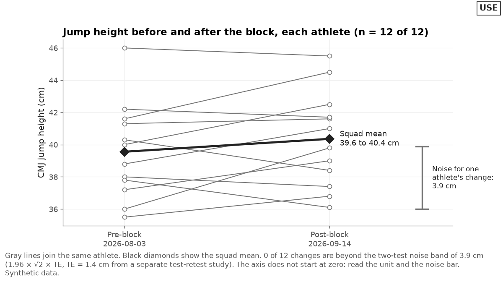
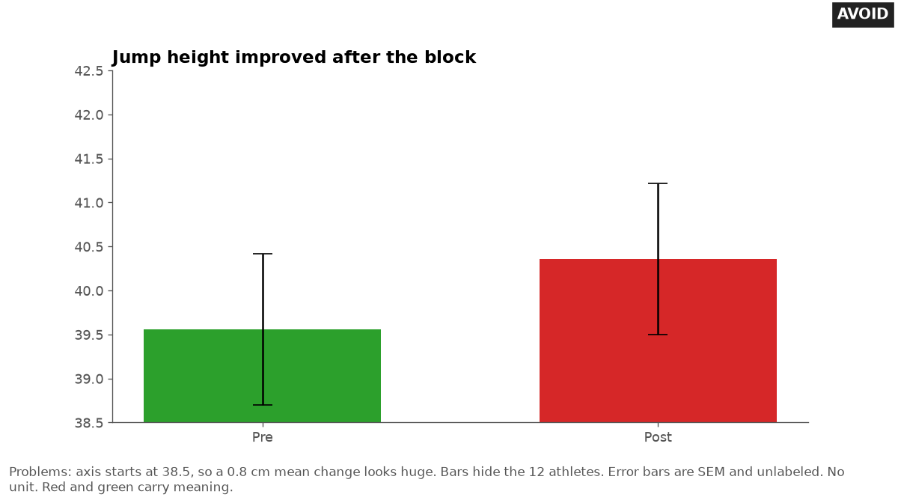

# Chart choice

Last checked: 2026-10-02

## What the problem is

AI tools pick a chart from the shape of the table, not from the question. A table with two columns of means becomes a bar chart.

A table with dates becomes a line chart with every athlete in one tangle. The chart then answers a question nobody asked, or hides the answer to the one they did.

## Rule

Name the question first. If no chart answers the question better than a table of numbers, use the table. Otherwise, pick the chart from this table:

| Question | Chart | Detail file |
|---|---|---|
| How has one athlete changed over time? | Line with a point per test, against the athlete's own baseline and noise band | [time-series.md](time-series.md) |
| Who in the squad moved from their own baseline? | Dot plot, one row per athlete, change on the x-axis, noise band shaded | [squad-views.md](squad-views.md) |
| How do values spread across the squad on one test day? | Dot plot or strip plot (one dot per athlete along one axis), or a box plot with the points on top | This file |
| How did the same athletes change from before to after? | Paired points joined by one line per athlete, plus the group mean | This file |
| How do two measures relate? | Scatter plot, with repeated measures handled | [relationships.md](relationships.md) |
| How do left and right compare? | Paired dot chart, one row per athlete | [relationships.md](relationships.md) |
| What share of a total does each part make up? | One stacked bar, or a short table. A pie only for two or three parts | This file |
| The user asks for a ranking | Sorted dot plot of change from each athlete's own baseline, with the noise band. Do not number ranks | [squad-views.md](squad-views.md) |
| How sure are we about a change? | Point with an interval, and the smallest worthwhile change shaded | [uncertainty.md](uncertainty.md) |
| What are the exact numbers? | Table with value, unit, change, and date | This file |

These choices are tool-independent. They hold in a spreadsheet, in Python, in R, in Power BI, and in Tableau. Only the menu steps and code differ.

### Prefer position on a common scale

People judge position along a common scale more accurately than length, angle, slope, or area (Cleveland and McGill, 1984; 1986). Accuracy also drops as the compared marks sit further apart (Cleveland and McGill, 1986).

So choose dot plots and line charts over pies, bubbles, and radar charts. Put the marks you want compared next to each other, on the same axis.

### Show every athlete

Many different sets of data give the same bar chart of means. The full data can suggest a different conclusion (Weissgerber et al., 2015). Viewers also judge a point inside a bar as more likely than a point the same distance outside it, so a bar of a mean distorts how they read the spread (Newman and Scholl, 2012).

Show every athlete's value. When dots hide each other, use a beeswarm or add a small random jitter. This is practice advice.

### Charts to avoid

Avoid these designs:

- **Dual vertical axes.** The ratio between the two scales is arbitrary, so rescaling one axis makes the lines appear to move together or apart. Use two charts with aligned time axes, or index both measures to 100 at a start date. This is practice advice, and some practitioners argue for dual axes in narrow cases.
- **3D bars and pies.** Adding depth made pie charts harder to judge, and made 3D bar charts slower to read (Siegrist, 1996).
- **Pies with many parts.** Pies ask the reader to judge angles, which they judge less accurately than positions along a common scale (Cleveland and McGill, 1984; 1986). Use a pie only for two or three parts, and only when the exact split matters less than the rough share. This limit is practice advice.
- **Bar charts with a truncated axis.** Starting the bar axis above zero makes differences look larger. The effect persisted even when the chart carried a visible cue that the axis was cut (Correll et al., 2020). Start every bar at zero.
- **Line charts that hide the scale of noise.** Correll and colleagues (2020) found that truncation inflates perceived effect size across chart types, even with cues that mark it. They suggest designers consider the scale of the meaningful effect sizes and variation they intend to show (Correll et al., 2020). So a line chart may start above zero when it shows the unit and the noise band, and the reader can judge a change against the noise.
- **Radar charts for profiles.** See [relationships.md](relationships.md).

## Good design

The good before-and-after chart shows CMJ (countermovement jump) height for 12 athletes. It draws each athlete as two hollow dark gray points joined by a thin dark gray line (`#767676`, 4.54:1 on white). The squad mean sits on top as a thick black line with diamond markers and a direct label: `Squad mean 39.6 to 40.4 cm`.

The y-axis reads `CMJ jump height (cm)`. The x-axis labels give the two dates.

The title gives the question and `n = 12 of 12`. A bar at the right shows the 3.9 cm noise for one athlete's change: `1.96 × √2 × TE`, with TE 1.4 cm from a separate test-retest study. The note says 0 of 12 changes are beyond that band, so no single athlete's change is larger than measurement error.



## Bad design

The bad version shows two bars, one green and one red, for the pre and post means. The axis starts at 38.5 cm, so a 0.8 cm change fills most of the chart. Unlabeled standard error bars sit on top.

The title says the block improved jump height. The chart hides the 12 athletes: 7 went up, 5 went down, and none changed by more than the 3.9 cm noise band.



## Common mistakes

These are the mistakes AI tools make most often when they choose a chart:

- Drawing a bar chart of means when the question is about individual athletes.
- Starting a bar axis at the lowest value instead of zero.
- Putting two measures with different units on one chart with two y-axes.
- Using a pie for eight position groups or ten training zones.
- Adding a 3D effect, shadow, or gradient by default.
- Drawing every athlete as a colored line on one chart, so no line can be followed.
- Picking a chart before asking what decision the chart supports.
- Using a radar chart for a test battery.

## Make it in Python

This matplotlib snippet draws the paired before-and-after chart:

```python
import matplotlib.pyplot as plt

pre = [38.0, 41.3, 36.0, 42.2, 40.3]    # cm, one value per athlete
post = [39.0, 41.6, 39.8, 41.7, 38.4]   # same athletes, same order
band = 1.96 * 2**0.5 * 1.4               # cm, two-test noise band, TE = 1.4 cm
fig, ax = plt.subplots(figsize=(6, 4))
for a, b in zip(pre, post):
    ax.plot([0, 1], [a, b], color="#767676", marker="o", mfc="white")
m_pre, m_post = sum(pre) / len(pre), sum(post) / len(post)
ax.plot([0, 1], [m_pre, m_post], color="black", lw=3, marker="D")
ax.text(1.05, m_post, f"Squad mean {m_pre:.1f} to {m_post:.1f} cm", va="center")
ax.set_xticks([0, 1], ["Pre", "Post"])
ax.set_xlim(-0.2, 1.8)
ax.set_ylabel("CMJ jump height (cm)")
ax.set_title(f"Jump height before and after the block (n = {len(pre)}); noise ± {band:.1f} cm")
fig.savefig("before_after.png", dpi=150, bbox_inches="tight")
```

The snippet is minimal. The full chart in `assets/` also adds the dates, a noise bar, the tested count in the title, and a note with the count of changes beyond the noise band.

## Make it in other tools

Use these notes for other tools:

- **Spreadsheet (Excel, Google Sheets, Numbers):** Make a line chart with the athletes as series and `Pre` and `Post` as the two categories. Set every series to the same gray. Add the mean as one more series in black. For any bar chart, set the vertical axis minimum to 0 by hand. Spreadsheets often choose a non-zero minimum on their own.
- **Python plotly:** Use one `go.Scatter` trace per athlete with `mode="lines+markers"` and one gray color.
- **R ggplot2:** Use `geom_line(aes(group = athlete))` and `geom_point()`, with the mean added from a summary table.
- **Power BI:** Use a line chart with `Pre` and `Post` on a categorical x-axis, `athlete_id` in the legend, and every athlete set to the same gray. Add the squad mean as a measure in black. Set bar chart axes to start at 0 by hand. See [bi-charts.md](bi-charts.md).
- **Tableau:** Put the test on Columns, the value on Rows, and `athlete_id` on Detail with a line mark in gray. Add the mean on a synchronized dual axis with the second header hidden. See [bi-charts.md](bi-charts.md).

## Example request

> I tested the squad's jumps before and after our 6-week block. Make me a chart that shows whether it worked.

## Check the result

Run these checks on the chart:

- Say the question the chart answers in one sentence. Confirm the chart type matches the table above.
- Confirm every bar starts at zero.
- Confirm there is one y-axis per chart.
- If a line chart starts above zero and judges change, confirm it shows the noise band or a noise bar.
- Count the athletes shown. Confirm the count matches the data, and that the title or subtitle states it.
- Confirm the title describes the data and does not claim a cause, such as `the block worked`.

## Sources

This file draws on these sources:

- Cleveland WS, McGill R. Graphical perception: theory, experimentation, and application to the development of graphical methods. *Journal of the American Statistical Association*. 1984;79(387):531-554. doi:10.1080/01621459.1984.10478080. Orders elementary perceptual tasks by accuracy and recommends dot charts in place of pie charts and bar charts.
- Cleveland WS, McGill R. An experiment in graphical perception. *International Journal of Man-Machine Studies*. 1986;25(5):491-500. doi:10.1016/S0020-7373(86)80019-0. Finds position judgments most accurate, length second, angle and slope third, and area last, and finds accuracy drops with distance between the judged marks. Both position judgments tested, along a common scale and along identical but non-aligned scales, were the most accurate.
- Weissgerber TL, Milic NM, Winham SJ, Garovic VD. Beyond bar and line graphs: time for a new data presentation paradigm. *PLOS Biology*. 2015;13(4):e1002128. doi:10.1371/journal.pbio.1002128. Shows that many data distributions give the same bar or line graph, and recommends showing the full data in small studies.
- Newman GE, Scholl BJ. Bar graphs depicting averages are perceptually misinterpreted: the within-the-bar bias. *Psychonomic Bulletin and Review*. 2012;19(4):601-607. doi:10.3758/s13423-012-0247-5. Finds viewers judge points inside a bar as more likely than points equally far outside it.
- Siegrist M. The use or misuse of three-dimensional graphs to represent lower-dimensional data. *Behaviour and Information Technology*. 1996;15(2):96-100. doi:10.1080/014492996120300. Finds 2D pie charts judged better than 3D pie charts, and 3D bar charts slower to evaluate.
- Correll M, Bertini E, Franconeri S. Truncating the y-axis: threat or menace? *Proceedings of the 2020 CHI Conference on Human Factors in Computing Systems*. 2020:1-12. doi:10.1145/3313831.3376222. Finds y-axis truncation increases perceived effect size across chart designs, even with visual cues that mark the truncation.
