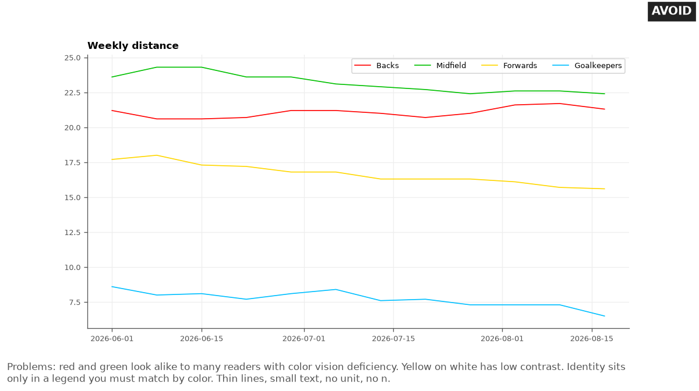

# Color and accessibility

Last checked: 2026-10-02

## What the problem is

AI tools color charts with the tool's default palette, or with red and green because they look like a traffic light. Many readers cannot tell red from green. Light colors such as yellow vanish on a white page.

A legend forces the reader to match small color swatches to lines. A chart image with no text description is invisible to a reader who uses a screen reader.

## Rule

Choose the scale type from the job the color does. Use a published color-blind-safe palette. Never carry meaning in color alone: add a label, a marker shape, or a position.

Meet contrast minimums. Label lines directly. Write alt text for every chart.

These rules are tool-independent. Every tool accepts hex color codes, marker shapes, and text labels. Only the menu steps differ.

### Match the scale to the job

Use one of three scale types (Harrower and Brewer, 2003):

- **Categorical (qualitative):** identity, such as position groups. Use distinct hues of similar weight, in a fixed order. Keep each group's color the same on every chart.
- **Sequential:** amount, from low to high, such as session load. Use one hue from light to dark.
- **Diverging:** above and below a meaningful midpoint, such as change from baseline or a correlation. Use two contrasting hues with a light neutral at the midpoint.

Avoid rainbow color maps. They distort data through uneven color gradients and are hard to read for people with color vision deficiency (Borland and Taylor, 2007; Crameri et al., 2020).


### Use a published color-blind-safe palette

In European Caucasians, red-green color deficiency affects about 8 percent of men and about 0.4 percent of women. In men of Chinese and Japanese ethnicity it affects 4 to 6.5 percent (Birch, 2012). Use one of these palettes:

| Job | Palette | Colors |
|---|---|---|
| Categorical | Okabe-Ito | black `#000000`, orange `#E69F00`, sky blue `#56B4E9`, bluish green `#009E73`, yellow `#F0E442`, blue `#0072B2`, vermillion `#D55E00`, reddish purple `#CC79A7` |
| Sequential | ColorBrewer `Blues` | 3 to 9 steps from colorbrewer2.org, or `Blues` in matplotlib |
| Diverging | ColorBrewer `PuOr`, `RdBu`, or `BrBG` | 3 to 11 steps from colorbrewer2.org, or the same names in matplotlib |

Okabe and Ito designed their palette to stay unambiguous for readers with and without color vision deficiency. The hex codes above are the ones R lists for its `Okabe-Ito` palette. ColorBrewer marks `Blues`, `PuOr`, `RdBu`, `BrBG`, and `RdYlBu` as colorblind safe.

It marks `RdYlGn` and `Spectral` only as possibly safe for 3 to 5 classes, and not safe for 6 or more. Do not use `RdYlGn` for athlete status.

Use at most 4 categorical colors on one chart when you can. Past that, use small multiples or highlight one group in color and put the rest in gray. This limit is practice advice.

Three findings support it. Only four Okabe-Ito colors other than black reach 3:1 on white (see the contrast table below). ColorBrewer rates no qualitative scheme colorblind friendly beyond 4 classes: `Paired` up to 4, and `Dark2` and `Set2` at 3. And the severe capacity limits of attention reduce how well viewers find a target, spot an odd one out, or judge how many categories a display holds (Haroz and Whitney, 2012).

Search for one color stayed rapid with up to 5 colors, and mostly stayed rapid with 7 carefully chosen colors (Healey, 1996). So 4 is a cautious choice, not a measured limit.

### Pair every color with a shape or label

Okabe and Ito advise against combining red and green, and advise showing a difference in both color and shape, such as solid and dotted lines or different symbols. The Web Content Accessibility Guidelines (WCAG) 2.2 are the W3C standard for accessible web content.

Success criterion 1.4.1 says color must not be the only visual means of conveying information. Follow these points:

- Give each series a different marker shape as well as a color.
- Print a word next to any flagged point, for example `below band`.
- Do not use red, amber, and green for athlete status. If a report requires them, add a text label and an icon in every cell. If the `coach-reports` skill is installed, follow its traffic-light guidance.

### Meet contrast minimums

WCAG 2.2 sets these minimums:

- Text: at least 4.5:1 against its background, or 3:1 for large text (18 point, or 14 point bold). This is success criterion 1.4.3.
- Graphical objects needed to understand the content, such as lines and markers: at least 3:1 against adjacent colors. This is success criterion 1.4.11.

These are the contrast ratios of the Okabe-Ito colors on a white background, computed with the WCAG formula:

| Color | Hex | Contrast on white |
|---|---|---|
| Black | `#000000` | 21.0:1 |
| Blue | `#0072B2` | 5.19:1 |
| Vermillion | `#D55E00` | 3.87:1 |
| Bluish green | `#009E73` | 3.42:1 |
| Reddish purple | `#CC79A7` | 3.06:1 |
| Sky blue | `#56B4E9` | 2.31:1 |
| Orange | `#E69F00` | 2.25:1 |
| Yellow | `#F0E442` | 1.32:1 |
| Dark gray | `#767676` | 4.54:1 |
| Mid gray | `#999999` | 2.85:1 |
| Band fill gray | `#E8E8E8` | 1.23:1 |

On a white background, prefer blue, vermillion, bluish green, and reddish purple for lines and markers. In a grayscale print, bluish green, vermillion, and reddish purple come out close in lightness (CIE L* 54 to 61), and only blue is clearly darker (L* 46). Do not rely on color alone. Use marker shapes. Use sky blue, orange, or yellow only for fills with a dark outline, or with labels that carry the meaning. Use `#767676` or darker for gray lines and points that carry information, such as per-athlete lines or a squad median.

A light fill such as `#E8E8E8` is fine for a noise band or a smallest worthwhile change zone only when the band's edges are drawn in `#767676` or darker, or the edge values are labeled. These contrast figures are computed with the WCAG formula, not taken from a paper.

### Label lines directly

Put the series name at the end of each line, in dark text, instead of in a legend box. The reader then does not have to match colors.

Keep label text black or dark gray, not the series color, so it meets the text contrast minimum. This is practice advice; it also supports the WCAG rule that color is not the only means of identification.

### Keep text readable

Keep axis labels, tick labels, and notes at least as large as body text at the size the chart is viewed. For a phone, size the figure at the width it displays. In matplotlib, 4 in wide at 100 dpi works. Set every text element, including the note, to at least 12 pt. Or put a long note in the report text, not in the image. Check the chart on a phone before you send it.

Put units in every axis label. These points are practice advice, not published thresholds.

### Write alt text

WCAG 2.2 success criterion 1.1.1 requires a text alternative for all non-text content. For a chart, the W3C Web Accessibility Initiative recommends two parts:

- A short alt text that names the chart type and the subject.
- A long description near the chart, such as a paragraph or a data table, that gives the key values, relationships, and trends.

As practice advice, follow this pattern for the short alt text:

```text
<Chart type> of <measure, unit> for <who>, <date range>. <The main finding in one sentence>.
```

For example: `Line chart of weekly countermovement jump (CMJ) height (cm) for one athlete, 2026-05-04 to 2026-08-17. One test on 2026-06-22 fell below her noise band; all later tests sat inside it.` Describe what the chart shows, not a cause or a decision.

## Good design

The good chart shows weekly running distance for four position groups. Each group has an Okabe-Ito color with at least 3:1 contrast on white and its own marker shape: circle, square, triangle, diamond. Each line ends in a dark text label with the group name and the last value.

There is no legend. The y-axis starts at 0 and reads `Mean weekly distance per athlete (km)`.


## Bad design

The bad chart uses pure red, green, yellow, and cyan thin lines. A small legend box carries the group names. Text is small, and the axis has no unit.



## Common mistakes

These are the mistakes AI tools make most often with color:

- Using red for bad and green for good as the only signal.
- Using a rainbow or `jet` color map for a heatmap.
- Using a sequential scale for change from baseline, which has a meaningful midpoint.
- Using a diverging scale for an amount that starts at zero.
- Recoloring groups when a filter removes one, so the same group changes color between charts.
- Generating a ninth or tenth color for more groups.
- Coloring the label text with the series color.
- Using yellow or light orange lines on white.
- Leaving out alt text, or writing alt text such as `chart`.

## Make it in Python

This matplotlib snippet uses Okabe-Ito colors, marker shapes, and direct labels:

```python
import matplotlib.pyplot as plt

weeks = list(range(1, 9))
groups = {"Backs": [20, 20, 21, 20, 20, 19, 20, 19],
          "Midfield": [24, 24, 23, 23, 23, 22, 23, 22],
          "Forwards": [18, 18, 17, 17, 17, 16, 16, 16]}
colors = ["#0072B2", "#D55E00", "#009E73"]        # Okabe-Ito blue, vermillion, bluish green
markers = ["o", "s", "^"]
fig, ax = plt.subplots(figsize=(7, 4))
for (name, km), c, m in zip(groups.items(), colors, markers):
    ax.plot(weeks, km, color=c, marker=m, lw=2)
    ax.text(weeks[-1] + 0.2, km[-1], name, va="center", color="#222222")
ax.set_xlim(0.5, 9.8)
ax.set_ylim(0, 30)
ax.set(xlabel="Week", ylabel="Mean weekly distance per athlete (km)")
fig.savefig("groups.png", dpi=150, bbox_inches="tight")
```

The snippet is minimal. The full chart in `assets/` also adds dates on the x-axis, the athlete count in the title, and the last value in each line label.

Write the alt text in the document or web page that shows the PNG, for example in the `alt` attribute of an `img` tag or the text of a Markdown image link.

## Make it in other tools

Use these notes for other tools:

- **Excel:** Set each series color by hex under **Format Data Series**, then **Fill and Line**. Set the marker type there too. Add a data label to the last point of each series and show the series name. To add alt text, right-click the chart border and select **Edit Alt Text** (Microsoft Support).
- **Python plotly:** Pass `color_discrete_sequence` with the hex codes, set `symbol` to vary marker shape, and add `fig.add_annotation` at each line end.
- **R ggplot2:** Use `scale_color_manual(values = ...)` with the hex codes, or `palette.colors(palette = "Okabe-Ito")` in base R 4.0 or later. Use `scale_fill_distiller(palette = "PuOr")` for a ColorBrewer diverging fill.
- **Power BI:** Import a theme JSON file with the Okabe-Ito hex codes in `dataColors`. Turn on markers with a different shape per series, and add alt text under **Format**, **General**. See [bi-charts.md](bi-charts.md).
- **Tableau:** Add the Okabe-Ito, ColorBrewer `Blues`, and ColorBrewer `PuOr` palettes to `Preferences.tps`. Put the same field on Shape as on Color. See [bi-charts.md](bi-charts.md).

## Example request

> Make this team distance chart readable for our color-blind assistant coach, and add alt text for the PDF report.

## Check the result

Run these checks on the chart:

- Print the chart in grayscale, or view it with a color vision deficiency simulator. Confirm every series and flag can still be told apart.
- Confirm no meaning depends on red versus green alone.
- Check each line and marker color against the contrast table. Confirm lines and markers reach 3:1 and text reaches 4.5:1.
- Confirm series are labeled directly, or the legend order matches the line order.
- Confirm the alt text names the chart type, measure, unit, who, the date range, and the main finding.

## Sources

This file draws on these sources. The Okabe and Ito page, the R source, ColorBrewer, WCAG, and the W3C tutorial are design guides and standards, not peer-reviewed papers:

- Okabe M, Ito K. Color Universal Design (CUD): how to make figures and presentations that are friendly to colorblind people. J*Fly. 2002, modified 2008. https://jfly.uni-koeln.de/color/. Accessed 2026-10-02. Proposes a palette unambiguous to readers with and without color vision deficiency, advises against red with green, and advises showing differences in both color and shape.
- R Core Team. `palette.colors()` source in the R `grDevices` package, file `src/library/grDevices/R/colorstuff.R` (read-only GitHub mirror of the R sources). https://github.com/wch/r-source/blob/trunk/src/library/grDevices/R/colorstuff.R. Accessed 2026-10-02. Lists the Okabe-Ito hex codes used here.
- Haroz S, Whitney D. How capacity limits of attention influence information visualization effectiveness. *IEEE Transactions on Visualization and Computer Graphics*. 2012;18(12):2402-2410. doi:10.1109/TVCG.2012.233. Finds that the severe capacity limits of attention strongly modulate how well viewers find targets, detect odd-ball items, and judge the number of categories in a display.
- Healey CG. Choosing effective colours for data visualization. *Proceedings of the Seventh Annual IEEE Visualization '96*. 1996:263-270. doi:10.1109/VISUAL.1996.568118. https://healey.csc.ncsu.edu/publications/15843.pdf. Accessed 2026-10-02. Finds search rapid and accurate for every color in 3-color and 5-color sets, slower for some colors in 7-color and 9-color sets, and mostly rapid again for a 7-color set chosen by color distance and color name.
- Harrower M, Brewer CA. ColorBrewer.org: an online tool for selecting colour schemes for maps. *The Cartographic Journal*. 2003;40(1):27-37. doi:10.1179/000870403235002042. Matches sequential, diverging, and qualitative schemes to the nature of the data.
- Brewer CA. ColorBrewer 2.0 scheme data, `colorbrewer_schemes.js`. https://colorbrewer2.org. Accessed 2026-10-02. Gives the colorblind-safe rating of each scheme by number of classes.
- Crameri F, Shephard GE, Heron PJ. The misuse of colour in science communication. *Nature Communications*. 2020;11:5444. doi:10.1038/s41467-020-19160-7. Shows that rainbow-like and red-green color maps distort data or are unreadable to people with color vision deficiency.
- Borland D, Taylor RM II. Rainbow color map (still) considered harmful. *IEEE Computer Graphics and Applications*. 2007;27(2):14-17. doi:10.1109/MCG.2007.323435. Explains why the rainbow color map is a poor choice and recommends alternatives.
- Birch J. Worldwide prevalence of red-green color deficiency. *Journal of the Optical Society of America A*. 2012;29(3):313-320. doi:10.1364/JOSAA.29.000313. Reports a prevalence in European Caucasians of about 8 percent in men and about 0.4 percent in women, and 4 to 6.5 percent in men of Chinese and Japanese ethnicity.
- W3C. Web Content Accessibility Guidelines (WCAG) 2.2. W3C Recommendation, 2024-12-12. https://www.w3.org/TR/WCAG22/. Success criteria 1.1.1, 1.4.1, 1.4.3, and 1.4.11.
- W3C Web Accessibility Initiative. Complex images tutorial. https://www.w3.org/WAI/tutorials/images/complex/. Accessed 2026-10-02. Recommends a short text alternative plus a long description for charts and graphs.
- Microsoft Support. Add alternative text to a shape, picture, chart, SmartArt graphic, or other object. https://support.microsoft.com/en-us/office/add-alternative-text-to-a-shape-picture-chart-smartart-graphic-or-other-object-44989b2a-903c-4d9a-b742-6a75b451c669. Accessed 2026-10-02.
