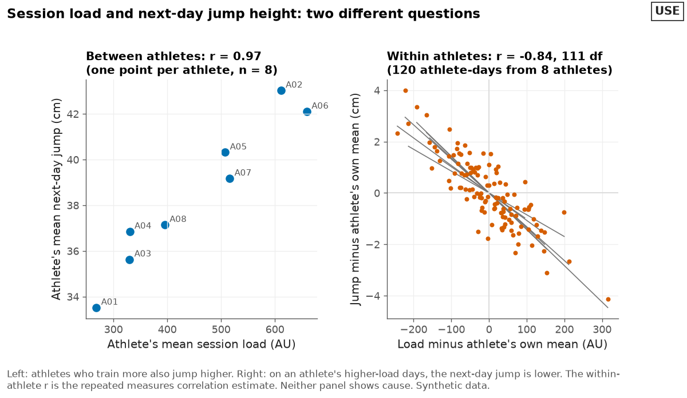
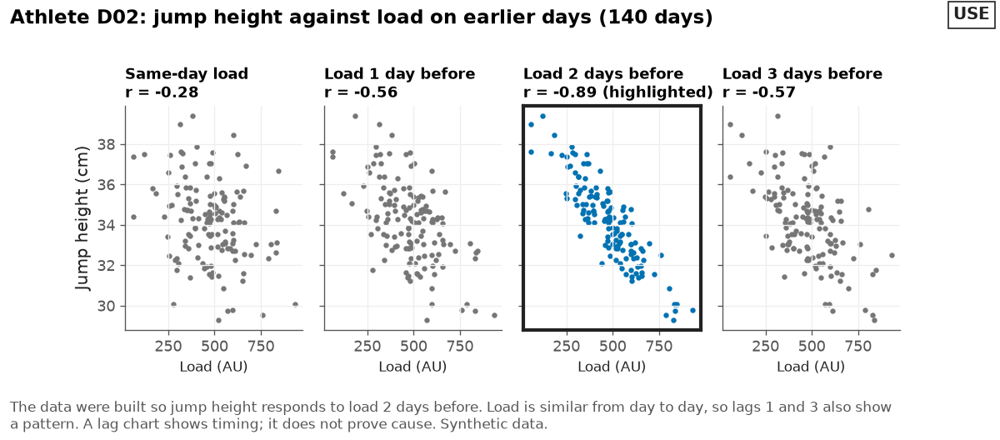
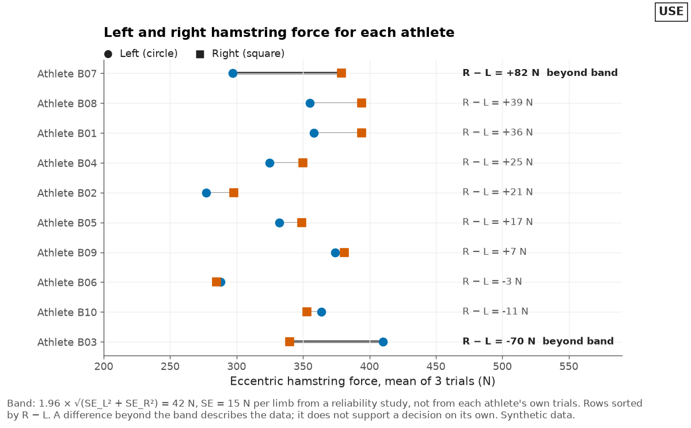
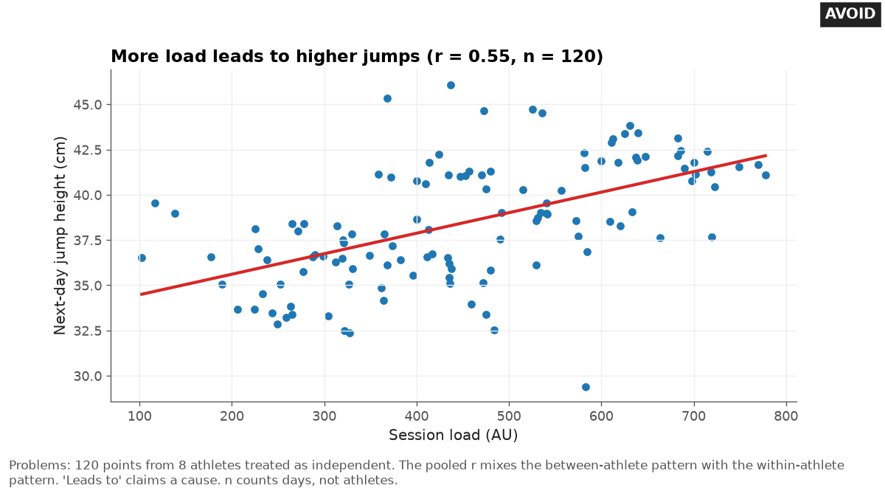
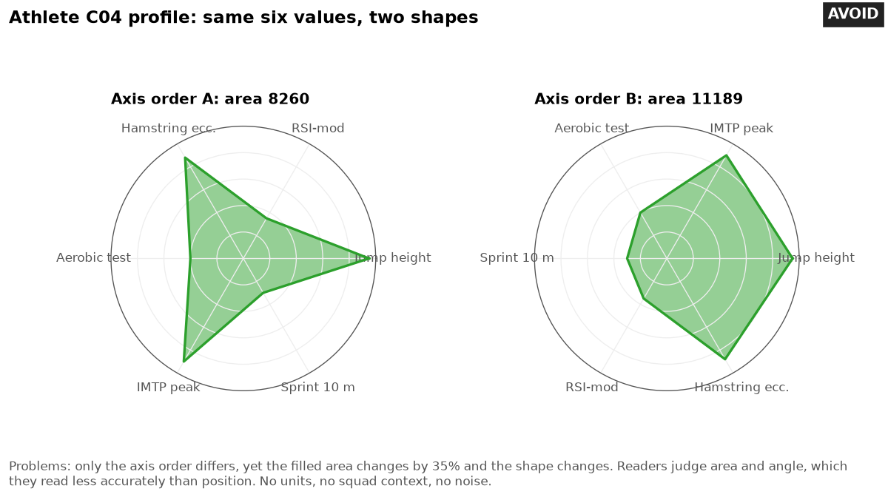

# Relationships between measures

Last checked: 2026-10-02

## What the problem is

Coaches ask how one measure relates to another: load and next-day jump height, sleep and wellness, left and right limbs, a test battery as a whole. Monitoring data has many rows per athlete.

AI tools pool all the rows into one scatter plot, compute one correlation, and draw one line. That answer mixes two different questions, and it can point the wrong way.

## Rule

Decide whether the question is about differences between athletes or about changes within an athlete. Plot the level that answers it.

Count athletes, not rows, when you report `n`. Describe an association in the title, never a cause.

These rules are tool-independent. The reshaping steps (athlete means, centering, lag columns) work the same in a spreadsheet, Python, R, Power BI, or Tableau.

### Separate between-athlete and within-athlete relationships

A between-athlete question asks: do athletes who train more tend to jump higher? Answer it with one point per athlete, such as each athlete's mean. Then `n` is the number of athletes.

A within-athlete question asks: on days when an athlete trains more than usual, does that athlete jump lower the next day? Answer it by subtracting each athlete's own mean from each of that athlete's values, then plotting the centered values together.

The correlation of the centered values equals the repeated measures correlation (rmcorr) estimate. Their slope equals the rmcorr common slope. The degrees of freedom are rows minus athletes minus 1. Bakdash and Marusich (2017) write this as N(k − 1) − 1, for N athletes with k values each on average.

The paper writes the model with one measure as deviations from each athlete's mean. It does not state that the correlation of centered values equals the rmcorr estimate. That equivalence follows from the model. It was checked against the `pingouin` package on the example data and on 2,000 random data sets with unequal rows per athlete.

A plain Pearson test on the centered values uses rows minus 2 degrees of freedom (118 in the example, not 111). It overstates precision. Take any p-value or interval from `rmcorr` or `pingouin.rm_corr`.

Do not pool the raw rows. Pooled correlation treats repeated measures as independent and can give biased, specious results when the between-athlete and within-athlete patterns differ (Bakdash and Marusich, 2017).

The direction of a group-level association can even reverse within the subgroups that make it up, which is Simpson's paradox (Kievit et al., 2013). Longitudinal models can separate the two effects (Curran and Bauer, 2011).

In the synthetic example below, 8 athletes give 120 daily rows. The pooled r is 0.55. The between-athlete r is 0.97 (n = 8).

The within-athlete r is -0.84 (rmcorr, 111 degrees of freedom). The pooled number describes neither question.

### Use small multiples for a few athletes

To show each athlete's own relationship, draw one small panel per athlete with the same axes on every panel. Keep the axes identical, or the panels cannot be compared.

Beyond about 20 panels, or when panels are too small to read at viewing size, switch to the centered plot or split by position group. This section is practice advice. Most evidence for small multiples comes from time-series charts (Javed et al., 2010; Hosseinpour et al., 2025).

One study gave each panel one entity's path on shared x and y axes. Those panels were more accurate than animation (Robertson et al., 2008). No study tested per-athlete scatter plots.

### Treat correlation matrices and heatmaps with care

A correlation heatmap looks thorough, but it carries these traps:

- **Many pairs, some by chance.** With `k` measures there are `k × (k − 1) / 2` pairs. With 10 measures that is 45 pairs. At a 5 percent false-positive rate per pair, about 2 would pass by chance alone if the pairs were independent; this figure is computed. Say this next to the matrix.
- **Small samples.** Correlations from small samples are unstable. In typical scenarios, the sample size should approach 250 for stable estimates (Schönbrodt and Perugini, 2013). A squad of 25 cannot pin down a correlation.
- **Pooled repeated measures.** A matrix built from all daily rows has the pooling problem above in every cell.
- **Color scale.** Use a diverging scale with a neutral midpoint at r = 0 and two hues for negative and positive. ColorBrewer offers diverging schemes for exactly this (Harrower and Brewer, 2003). Print the r value and the `n` in each cell, because a reader cannot read an exact value from a color. This is practice advice.
- **Reordering.** Clustering rows and columns makes blocks appear. Say when you reordered.

Show the scatter plot behind any pair that matters to the decision.

### Show lagged relationships by lag

Load on one day may relate to a response days later. Build the lag inside each athlete on a complete daily calendar.

Include rest days as 0 and missing days as blank, so a shift of 2 rows means 2 days. Then plot the response against load at several lags, one panel per lag, on shared axes. If the user supplies load already paired with a later response, say that you used their pairing, and ask how rest days and missing days were handled.

Expect neighboring lags to look related too. Load on one day is usually similar to load on the day before, which is autocorrelation.

Cross-correlations between autocorrelated series can show relationships that are not there, and even a real cross-correlation does not show cause (Dean and Dunsmuir, 2016). Treat a lag chart as a description of timing.

### Use connected scatter plots sparingly

A connected scatter plot puts two measures on the x and y axes and joins one athlete's points in time order. Simple connected scatter plots can be read with little explanation, but readers make specific misreadings of them (Haroz et al., 2016). As practice advice, use one only for one athlete and a short span.

Label the first and last dates and mark the direction of time with an arrow. Otherwise, use two time-series panels with an aligned time axis.

### Compare limbs with a paired dot chart

Draw one row per athlete. Put the left value and the right value on the same axis with different marker shapes, such as a circle for left and a square for right.

Join them with a line. Print the difference with its unit at the end of the row.

Treat an asymmetry as beyond noise only if the left-right difference exceeds a 95 percent band:

```text
asymmetry band = 1.96 × √(SE_L² + SE_R²)
```

Build the band this way:

- `SE_L`, `SE_R`: the standard error of each limb's value, in the unit of the measure. Use the TE, or a pooled squad coefficient of variation (CV, the TE as a percent of the mean) divided by `√k` for a mean of `k` trials. Convert a CV to units by multiplying it by that limb's value, so the band and the printed difference share a unit.
- Take the SE from a squad reliability study, or from a published reliability study of the same test, device, and population, never from one athlete's own trials or from the same trials you are judging.
- Compute the SE on the same summary as the plotted values, such as the mean of 3 trials.
- `1.96`: the multiplier for 95 percent, a choice. Use a t value when the SE comes from few athletes, as in [time-series.md](time-series.md).

The band is derived by adding the two limbs' error variances; it is not a published formula. It assumes independent errors on each limb and a constant true value during testing. If the `limb-symmetry` skill is installed, use its formula variants and reference-limb rule for any index you print.

Write `beyond band` next to those rows, in bold or with a heavier line, not only in color. Do not call an athlete injured, at risk, or cleared because of a difference.

### Show dose-response with the raw data

A dose-response chart plots a response against a dose, such as next-day jump height against session load in arbitrary units (AU). Follow these points:

- Plot the raw points, not only the fitted curve.
- Fit within athletes when the question is within athletes. A between-athlete curve does not describe one athlete's response (Kievit et al., 2013).
- Shade or mark the range of doses in the data. Do not extend the curve past it.
- Name the fitting method and its settings in the note, for example `straight line` or `LOESS, span 0.75`. LOESS is a local smoothing curve; its span sets how smooth it is.
- Title the chart as an association, for example `Next-day jump height against session load`.

These points are practice advice, apart from the cited within-athlete point.

### Show multi-measure profiles on one shared axis

A radar chart puts each measure on its own spoke and fills the polygon. It misleads in three ways:

- The filled area and the shape depend on the order of the spokes. In the synthetic example below, only the spoke order changes, and the area changes by up to 35 percent. That figure compares the smallest and largest areas across the 120 possible spoke orders. It is computed from the example, not from a study.
- It asks readers to judge angle and area, which they judge less accurately than position along a common scale (Cleveland and McGill, 1984; 1986).
- In a controlled experiment, the radar chart was the least effective and least liked of three radial designs for composite indicators (Albo et al., 2016).

Use a dot plot instead. Put one row per measure, a shared x-axis in standard deviations from the squad mean or from the athlete's own baseline, and the athlete as a large dot. Show squad members as small gray dots.

Print the raw value and unit at the end of each row. Flip the sign for timed tests so right always means a higher score, and say so in the row label.

State which SD you used. An SD from the athlete's own baseline is a display scale here, not TE.

## Good design

The good relationship chart has two panels. The left panel shows one point per athlete, each athlete's mean load against mean next-day jump, labeled with athlete codes: `Between athletes: r = 0.97 (n = 8)`.

The right panel shows all 120 athlete-days from the 8 athletes as vermillion points, centered on each athlete's own means, with a thin dark gray fit line per athlete: `Within athletes: r = -0.84, 111 df`. The note says neither panel shows cause.



The lag chart shows one athlete's jump height against load at 0, 1, 2, and 3 days before, on shared axes. The 2-day panel is highlighted three ways: blue points, a heavy black frame, and the word `highlighted` in its title.

The other panels use dark gray points. The note says lags 1 and 3 also show a pattern because load is similar from day to day.



The limb chart shows 10 athletes as rows, left as blue circles and right as vermillion squares, sorted by right minus left. Two rows beyond the 42 N band carry bold labels and a heavier black line. The note says a difference beyond the band describes the data and does not support a decision on its own.



The profile chart shows one athlete across six tests on one axis of standard deviations from the squad mean, computed from the plotted squad data. The squad shows as small dark gray dots and the athlete as a large blue dot, with raw values at the right.


## Bad design

The bad scatter plot pools 120 daily rows from 8 athletes into one cloud with one red regression line. The title reads `More load leads to higher jumps (r = 0.55, n = 120)`. It claims a cause, counts days as if they were athletes, and hides that each athlete jumps lower after heavier days.



The bad profile chart shows the same six values as two radar charts. Only the spoke order differs, yet one polygon has up to 35 percent more area and a different shape.



## Common mistakes

These are the mistakes AI tools make most often with relationships:

- Computing one Pearson r across all rows from all athletes.
- Reporting `n` as the number of rows when the question is about athletes.
- Writing `leads to`, `causes`, `drives`, or `predicts` in a title for an observational correlation.
- Showing a 20-by-20 correlation heatmap from one squad with no `n` and no note on chance findings.
- Using a rainbow or red-green scale on a correlation matrix, or a scale without a neutral midpoint at 0.
- Building lags with a row shift on data that skips rest days, so a shift of 2 rows is not 2 days.
- Shifting lags across athletes, so one athlete's load lines up with another athlete's response.
- Using a radar chart for a test battery.
- Computing a limb asymmetry band from the athlete's own trials.
- Drawing a dose-response curve past the range of the data.

## Make it in Python

This matplotlib snippet draws the between-athlete and within-athlete panels. It expects a file with `athlete`, `load`, and `jump` columns:

```python
import pandas as pd
import matplotlib.pyplot as plt

d = pd.read_csv("daily.csv").dropna(subset=["load", "jump"])   # athlete, load, jump
means = d.groupby("athlete")[["load", "jump"]].mean()
cent = d[["load", "jump"]] - d.groupby("athlete")[["load", "jump"]].transform("mean")
r_between = means.load.corr(means.jump)
r_within = cent.load.corr(cent.jump)                  # equals the rmcorr estimate
fig, (a1, a2) = plt.subplots(1, 2, figsize=(9, 4))
a1.scatter(means.load, means.jump, color="#0072B2")
a1.set(title=f"Between athletes: r = {r_between:.2f} (n = {len(means)})",
       xlabel="Athlete mean load (AU)", ylabel="Athlete mean jump (cm)")
a2.scatter(cent.load, cent.jump, s=10, color="#D55E00")
a2.set(title=f"Within athletes: r = {r_within:.2f}, {len(d) - len(means) - 1} df",
       xlabel="Load minus own mean (AU)", ylabel="Jump minus own mean (cm)")
fig.tight_layout()
fig.savefig("within_between.png", dpi=150)
```

The snippet is minimal. The full chart in `assets/` also adds athlete labels on the left panel, one fit line per athlete on the right panel, and a note that neither panel shows cause.

For a lag of 2 days on a complete daily calendar, sort first with `d = d.sort_values(["athlete", "date"])`, then use `d["load_lag2"] = d.groupby("athlete")["load"].shift(2)`. For a p-value and interval on the within-athlete r, use the `rmcorr` package in R or `pingouin.rm_corr` in Python.

## Make it in other tools

Use these notes for other tools:

- **Spreadsheet:** Build athlete means with a pivot table for the between-athlete chart. For the within-athlete chart, add columns `load minus athlete mean` and `jump minus athlete mean` with `AVERAGEIF`, then plot those two columns. For a lag, sort by athlete and date, confirm every calendar day has a row, and reference the cell 2 rows up only when the athlete ID matches.
- **Python plotly:** Use `px.scatter(..., facet_col="athlete", facet_col_wrap=4)` for small multiples with shared axes.
- **R ggplot2:** Use `facet_wrap(~ athlete)` for small multiples. Use `geom_point()` with `geom_segment()` for the paired limb chart.
- **Power BI:** Small multiples do not support scatter charts. Use the centered within-athlete chart, or one scatter chart with an athlete slicer. Build a lag against the date table, not by row. See [bi-charts.md](bi-charts.md).
- **Tableau:** Put `athlete_id` on Rows or Columns for one scatter panel per athlete. Use `LOOKUP` on a calendar scaffold for a lag. See [bi-charts.md](bi-charts.md).

## Example request

> Is there a relationship between training load and next-day jump height in my squad? I have daily load and jumps for 8 players over 3 weeks.

Status: not tested.

## Check the result

Run these checks on the chart:

- Say whether the question is between athletes or within athletes. Confirm the plotted level matches.
- Confirm `n` counts athletes for between-athlete results, and that rows and athletes are both stated for within-athlete results.
- Confirm no title or label claims a cause.
- For a correlation matrix, confirm each cell shows r and `n`, the scale is diverging with a neutral midpoint at 0, and the note states how many pairs are shown.
- For a lag chart, confirm the lag was built within each athlete on a complete calendar.
- For a limb chart, confirm the band uses a squad or reliability-study SE.
- For a profile, confirm all measures share one axis and raw values with units are printed.

## Sources

This file draws on these sources:

- Bakdash JZ, Marusich LR. Repeated measures correlation. *Frontiers in Psychology*. 2017;8:456. doi:10.3389/fpsyg.2017.00456. Explains that simple correlation on repeated measures violates independence and can give biased, specious results, and introduces rmcorr for the common within-individual association.
- Kievit RA, Frankenhuis WE, Waldorp LJ, Borsboom D. Simpson's paradox in psychological science: a practical guide. *Frontiers in Psychology*. 2013;4:513. doi:10.3389/fpsyg.2013.00513. Shows an association can reverse between population and subgroup levels, most often when inferences cross levels of explanation.
- Curran PJ, Bauer DJ. The disaggregation of within-person and between-person effects in longitudinal models of change. *Annual Review of Psychology*. 2011;62:583-619. doi:10.1146/annurev.psych.093008.100356. Reviews methods that separate within-person and between-person effects.
- Javed W, McDonnel B, Elmqvist N. Graphical perception of multiple time series. *IEEE Transactions on Visualization and Computer Graphics*. 2010;16(6):927-934. doi:10.1109/TVCG.2010.162. Finds separate charts per series more efficient for comparisons across a large visual span, and one shared chart faster over a small visual span. Tested 2, 4, and 8 time series in the main experiment.
- Hosseinpour H, Matzen LE, Divis KM, Castro SC, Padilla L. Examining limits of small multiples: frame quantity impacts judgments with line graphs. *IEEE Transactions on Visualization and Computer Graphics*. 2025;31(3):1875-1887. doi:10.1109/TVCG.2024.3372620. https://par.nsf.gov/servlets/purl/10503942. Accessed 2026-10-02. Finds a linear decline in accuracy as small multiples of line charts grow from 2 to 70 frames, with no threshold.
- Robertson G, Fernandez R, Fisher D, Lee B, Stasko J. Effectiveness of animation in trend visualization. *IEEE Transactions on Visualization and Computer Graphics*. 2008;14(6):1325-1332. doi:10.1109/TVCG.2008.125. https://faculty.cc.gatech.edu/~stasko/papers/infovis08-anim.pdf. Accessed 2026-10-02. Finds small multiples, with one country's trend path per panel on shared axes, more accurate than animation. Overall accuracy was low, at 65 percent.
- Schönbrodt FD, Perugini M. At what sample size do correlations stabilize? *Journal of Research in Personality*. 2013;47(5):609-612. doi:10.1016/j.jrp.2013.05.009. Finds that in typical scenarios the sample size should approach 250 for stable correlation estimates.
- Harrower M, Brewer CA. ColorBrewer.org: an online tool for selecting colour schemes for maps. *The Cartographic Journal*. 2003;40(1):27-37. doi:10.1179/000870403235002042. Matches sequential, diverging, and qualitative schemes to the nature of the data.
- Dean RT, Dunsmuir WTM. Dangers and uses of cross-correlation in analyzing time series in perception, performance, movement, and neuroscience: the importance of constructing transfer function autoregressive models. *Behavior Research Methods*. 2016;48(2):783-802. doi:10.3758/s13428-015-0611-2. Shows cross-correlations between autocorrelated series can indicate spurious relationships, and that a genuine cross-correlation does not establish cause.
- Haroz S, Kosara R, Franconeri SL. The connected scatterplot for presenting paired time series. *IEEE Transactions on Visualization and Computer Graphics*. 2016;22(9):2174-2186. doi:10.1109/TVCG.2015.2502587. Finds low-complexity connected scatter plots can be understood with little explanation, and describes common misinterpretations.
- Albo Y, Lanir J, Bak P, Rafaeli S. Off the radar: comparative evaluation of radial visualization solutions for composite indicators. *IEEE Transactions on Visualization and Computer Graphics*. 2016;22(1):569-578. doi:10.1109/TVCG.2015.2467322. Finds the radar chart the least effective and least liked of three radial designs.
- Cleveland WS, McGill R. Graphical perception: theory, experimentation, and application to the development of graphical methods. *Journal of the American Statistical Association*. 1984;79(387):531-554. doi:10.1080/01621459.1984.10478080. Orders perceptual tasks by accuracy and recommends graphs that use the most accurate ones.
- Cleveland WS, McGill R. An experiment in graphical perception. *International Journal of Man-Machine Studies*. 1986;25(5):491-500. doi:10.1016/S0020-7373(86)80019-0. Finds the two position judgments most accurate, length second, angle and slope third, and area last.
