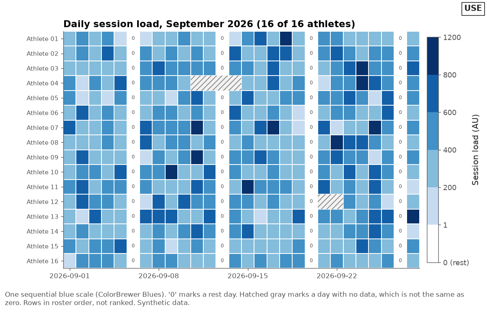
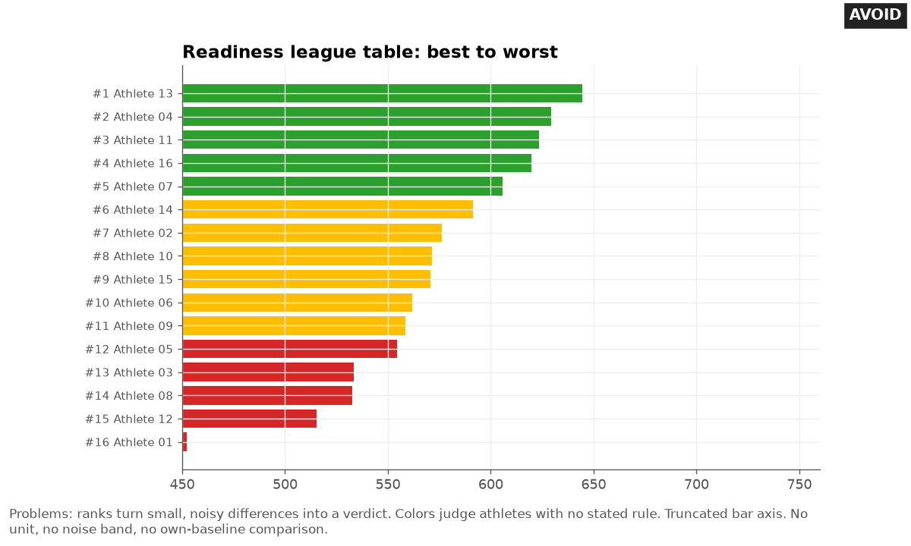

# Squad views

Last checked: 2026-10-02

## What the problem is

A coach wants to see the whole squad at once. AI tools answer with one of three charts: a tangle of 25 colored lines, a bar chart ranked best to worst, or a red-amber-green table. The tangle cannot be read.

The ranking turns small, noisy differences into a verdict on each athlete. The colors judge athletes with no stated rule, and a missing test often shows up as green or as zero.

## Rule

Compare each athlete to that athlete's own baseline before you compare athletes to each other. Order rows by roster, position, or change from own baseline, never by a judgment of the athlete.

Show the noise band, list missing athletes, and print the number of flags expected by chance. Use color for one thing at a time.

These rules are tool-independent. Sorting, gray context lines, and shared axes work the same in every tool.

### Use small multiples for trends

Draw one small panel per athlete, each with the athlete's own baseline and noise band. Give every panel the same x-axis and the same y-axis range, so a change of 3 cm looks the same size in every panel. Separate panels per series were more efficient than one shared chart for comparisons across a large visual span.

One shared chart was faster for comparisons over a small visual span. The main experiment tested 2, 4, and 8 series (Javed et al., 2010).

Order panels by roster or position group, not by score. Beyond about 20 panels, or when panels are too small to read the band at viewing size, split by position group. The number 20 is practice advice.

With small multiples of line charts from 2 to 70 panels, accuracy fell steadily as panels were added, with no single point where it collapsed (Hosseinpour et al., 2025). Highlighting the panels of interest reduced the loss but did not remove it. So highlight the athletes the coach asked about.

### Use a sorted dot plot for "who moved"

Put one row per athlete. Plot each athlete's change in CMJ (countermovement jump) height, or another measure, from their own baseline as a dot on a shared x-axis, with the noise band shaded around zero. Dot charts use position along a common scale, which readers judge most accurately (Cleveland and McGill, 1984; 1986).

Follow these points:

- Sort by the size of the change, and say so in the note: `Sorted by change, not by ability`.
- Mark athletes outside the band with a different shape and the words `outside band`.
- List athletes with no test at the bottom as `no test`. Never drop them or show them as zero.
- Put the number tested out of the roster in the title, for example `20 of 22 tested`.
- Print the number of flags expected by chance next to the number found.

Count chance flags this way. With all assumptions met, about 5 percent of pure-noise changes fall outside a 95 percent band in either direction, or 2.5 percent in one direction of interest. For 20 athletes checked in either direction, expect 1.0 flag by chance per check, with a 64 percent chance of at least one.

For 25 athletes checked in one direction, expect 0.625, with a 46.9 percent chance of at least one. When assumptions fail, the real rate can be higher or lower, so never call 5 percent a lower bound.

Flags in consecutive weeks against the same baseline are not independent. Recommend a repeat test before anyone acts on a single flag, because of regression to the mean: unusually high or low values tend to be followed by values closer to the athlete's mean (Barnett et al., 2005).

Use the noise band `1.96 × TE × √(1 + 1/n)`. TE is the typical error from a short-term test-retest study. `n` is the number of values in the athlete's baseline.

The 95 percent level is a choice. The `√(1 + 1/n)` term adds the variance of the baseline mean, as in Hopkins (2017). See [time-series.md](time-series.md) for the full band rules and assumptions.

If athletes have different `n`, each has a different band. Draw each band as a short gray segment on its own row.

### Highlight one athlete against the squad in gray

To show one athlete in context, draw every other athlete as a thin light gray line or dot with no label. Draw the athlete of interest in one strong color with a thicker line and a direct label.

Add the squad median as a dark gray line (`#767676`, 4.54:1 on white) if it helps. Teammates' light gray lines are context only, so the athlete's line, band, and the median carry the information at 3:1 contrast or more.

This approach is practice advice. Use it in coach views only. Do not show an athlete other athletes' identifiable data.

### Use heatmaps for athletes by days

A heatmap puts athletes in rows, days in columns, and a value in each cell. Follow these points:

- For an amount such as session load, use one sequential hue from light to dark. For change from baseline, use a diverging scale with a neutral midpoint at zero (Harrower and Brewer, 2003).
- Keep missing days visibly different from zero. Use hatching or a gray pattern for missing, and a light cell with `0` for a rest day.
- Add a color key with the unit and the bin edges, including the edge between rest (0) and the first load bin.
- Order rows by roster or position, not by total load.
- Readers cannot read exact values from color. Pair the heatmap with a table, or print values in the cells you discuss.

The heatmap points above are practice advice, apart from the cited scale types.

### Avoid ranking that reads as judgment

A league table invites the reader to treat rank as a verdict. In comparisons of institutions, ranks are particularly sensitive to sampling variability, so the uncertainty around estimates and ranks must be shown. Goldstein and Spiegelhalter (1996) concluded that rankings can serve as screening instruments, not as definitive judgments on individual institutions.

The same logic applies to a squad. Goldstein and Spiegelhalter applied it to individual surgeons. Wide rank intervals also appear for Test cricket batsmen (Boys and Philipson, 2019).

Take a simulated squad of 25 with no real change. When TE is a quarter of the between-athlete SD, about a third of athletes move 3 or more places between two tests. When TE is half the SD, over half do. These figures are computed, not published.

Follow these points:

- Do not number athletes `#1` to `#25`. Do not use medals, `best`, `worst`, `top`, or `bottom`.
- If the user needs an order, sort by change from own baseline, and show the noise band.
- If the user insists on a ranking, show each value with the noise for one test. Say that two athletes differ beyond noise only if their difference exceeds `1.96 × √2 × TE`, about `2.77 × TE`. Do not base this on whether two intervals overlap. To compare two athletes' changes from their own baselines, use `1.96 × TE × √(2 × (1 + 1/n))`. With TE 1.4 cm and `n = 5`, that is 4.25 cm. This band is derived by adding variances and computed, not published.
- Do not color athletes red, amber, or green by rank or by an unstated cut point.
- Do not rank composite readiness or wellness scores. Show the parts.
- Write titles that describe the data, such as `Change from own baseline, week of 2026-09-28`, not `Who is ready`.

## Good design

The good squad chart lists 22 athletes. Twenty rows show a dot for the change in jump height from each athlete's own baseline, sorted by change. A gray band with dark gray edges covers plus or minus 3.0 cm.

Two athletes outside the band have filled diamonds and bold `outside band` labels. Two athletes with no test sit at the bottom, labeled `no test this week`. The note says 1.0 flag is expected by chance and 2 were found, and asks for a retest before acting.


The highlight chart shows 20 athletes' weekly jump height as thin light gray context lines, the squad median in dark gray, and one athlete as a thick blue line with a direct label. A light blue band with blue edges shows that athlete's own noise band, so the chart can start above zero and still show the scale of noise.


The heatmap shows 16 athletes by 28 days of session load on one blue scale. Rest days show `0` in a white cell.

Missing days show gray hatching. Rows follow roster order.



## Bad design

The bad chart is a horizontal bar chart titled `Readiness league table: best to worst`. Athletes are numbered `#1` to `#16`. The top five bars are green, the middle six amber, and the bottom five red, with no stated rule.

The bar axis starts at 450, so the last athlete's bar is almost invisible. There is no unit, no noise band, and no comparison with each athlete's own baseline.



## Common mistakes

These are the mistakes AI tools make most often with squad views:

- Plotting every athlete as a colored line on one chart.
- Ranking athletes best to worst on a noisy measure.
- Coloring athletes red, amber, or green by rank or by a cut point nobody stated.
- Dropping athletes with no data, so the squad looks complete.
- Showing a missing day as zero load in a heatmap.
- Giving each athlete's panel its own y-axis range.
- Comparing athletes to the squad mean before comparing them to their own baseline.
- Leaving out how many flags to expect by chance.
- Using a rainbow scale in a heatmap.
- Sharing a squad chart with athletes.

## Make it in Python

This matplotlib snippet draws the sorted change dot plot with the noise band and missing athletes:

```python
import numpy as np
import pandas as pd
import matplotlib.pyplot as plt

d = pd.read_csv("changes.csv")              # columns: athlete, change_cm (blank if not tested)
half = 1.96 * 1.4 * np.sqrt(1 + 1 / 5)      # TE = 1.4 cm, n = 5 baseline tests
d = pd.concat([d.dropna().sort_values("change_cm"), d[d.change_cm.isna()]]).reset_index(drop=True)
out = d.change_cm.abs() > half
fig, ax = plt.subplots(figsize=(7, 0.3 * len(d) + 1.5))
ax.axvspan(-half, half, fc="#E8E8E8", ec="#767676")       # band, 3:1 edges
ax.scatter(d.change_cm[~out], d.index[~out], facecolor="white", edgecolor="#0072B2")
ax.scatter(d.change_cm[out], d.index[out], marker="D", color="#0072B2")
for i in d.index:
    label = "no test" if pd.isna(d.change_cm[i]) else ("  outside band" if out[i] else "")
    ax.text(-half if label == "no test" else d.change_cm[i], i, label, va="center", style="italic")
ax.set_yticks(d.index, d.athlete)
ax.set_ylim(len(d) - 0.5, -0.5)                 # first row at the top
ax.set_xlabel(f"Change from own baseline (cm); band ± {half:.1f} cm")
fig.savefig("squad_change.png", dpi=150, bbox_inches="tight")
```

The snippet is minimal. The full chart in `assets/` also adds the tested count in the title, the number of flags expected by chance in the note, a printed value for each row, and a retest reminder.

## Make it in other tools

Use these notes for other tools:

- **Spreadsheet:** For the dot plot, use a scatter chart with change on the x-axis and a row number on the y-axis, and label the rows with athlete names. Sort the table by change before you chart it, and keep untested athletes in the table. For a heatmap, use conditional formatting with a two-color or three-color scale on the grid. Leave missing days blank and give blank cells a pattern or a gray fill, so they differ from 0.
- **Python plotly:** Use `px.strip` or `go.Scatter` for the dot plot and `go.Heatmap` with `colorscale="Blues"` for the heatmap.
- **R ggplot2:** Use `geom_point()` with `reorder(athlete, change)` for the dot plot, and `geom_tile()` with `scale_fill_distiller(palette = "Blues", direction = 1)` for the heatmap. Set `na.value` to a gray that differs from the lowest color.
- **Power BI:** Use the **Small multiples** well with **Shared y-axis** on. For a heatmap, use a matrix with **Show items with no data** and a background color from a measure that returns a gray for missing days. See [bi-charts.md](bi-charts.md).
- **Tableau:** Put `athlete_id` on Rows for small multiples, with a reference band per pane. For a heatmap, use square marks on a calendar scaffold and a binned color field with a `no data` bin. See [bi-charts.md](bi-charts.md).

## Example request

> Give me one view of the whole squad's jump testing this week so I can see who has moved away from their normal. Don't make it a ranking.

## Check the result

Run these checks on the chart:

- Count the rows. Confirm the count matches the roster, and that untested athletes appear as `no test`.
- Read the title and the row order. Confirm neither implies a ranking of athletes.
- Confirm every flagged athlete is beyond the band, and is marked by shape and label as well as color.
- Confirm the note gives the number of flags expected by chance and the number found.
- In a heatmap, confirm missing cells look different from zero cells.
- Confirm bands have edges at 3:1 contrast or labeled edge values.
- In small multiples, confirm every panel shares the same axes.

## Sources

This file draws on these sources:

- Javed W, McDonnel B, Elmqvist N. Graphical perception of multiple time series. *IEEE Transactions on Visualization and Computer Graphics*. 2010;16(6):927-934. doi:10.1109/TVCG.2010.162. Finds separate charts per series, such as small multiples, more efficient for comparisons across a large visual span, and one shared chart faster over a small visual span. Tested 2, 4, and 8 series in the main experiment.
- Hosseinpour H, Matzen LE, Divis KM, Castro SC, Padilla L. Examining limits of small multiples: frame quantity impacts judgments with line graphs. *IEEE Transactions on Visualization and Computer Graphics*. 2025;31(3):1875-1887. doi:10.1109/TVCG.2024.3372620. https://par.nsf.gov/servlets/purl/10503942. Accessed 2026-10-02. Finds a linear decline in accuracy as small multiples of line charts grow from 2 to 70 frames, with no threshold, and finds that highlighting frames reduces but does not remove the decline.
- Cleveland WS, McGill R. Graphical perception: theory, experimentation, and application to the development of graphical methods. *Journal of the American Statistical Association*. 1984;79(387):531-554. doi:10.1080/01621459.1984.10478080. Recommends dot charts, which use position along a common scale.
- Cleveland WS, McGill R. An experiment in graphical perception. *International Journal of Man-Machine Studies*. 1986;25(5):491-500. doi:10.1016/S0020-7373(86)80019-0. Finds position judgments the most accurate.
- Harrower M, Brewer CA. ColorBrewer.org: an online tool for selecting colour schemes for maps. *The Cartographic Journal*. 2003;40(1):27-37. doi:10.1179/000870403235002042. Matches sequential and diverging schemes to the nature of the data.
- Goldstein H, Spiegelhalter DJ. League tables and their limitations: statistical issues in comparisons of institutional performance. *Journal of the Royal Statistical Society Series A*. 1996;159(3):385-409. doi:10.2307/2983325. Shows ranks are particularly sensitive to sampling variability (section 3.2), calls for interval estimates that display the uncertainty around estimates and ranks, and concludes that rankings can serve as screening instruments but not as definitive judgments on individual institutions.
- Boys RJ, Philipson PM. On the ranking of Test match batsmen. *Journal of the Royal Statistical Society Series C*. 2019;68(1):161-179. doi:10.1111/rssc.12298. Preprint: https://arxiv.org/abs/1806.05496. Accessed 2026-10-02. Finds wide rank intervals for most batsmen because of innings-to-innings variation, and links this to Goldstein and Spiegelhalter's point on ranking individuals with similar performance.
- Barnett AG, van der Pols JC, Dobson AJ. Regression to the mean: what it is and how to deal with it. *International Journal of Epidemiology*. 2005;34(1):215-220. doi:10.1093/ije/dyh299. Explains how unusually large or small values tend to be followed by values closer to the mean.
- Hopkins WG. A spreadsheet for monitoring an individual's changes and trend. *Sportscience*. 2017;21:5-9. https://www.sportsci.org/2017/wghtrend.htm. Accessed 2026-10-02. Its monitoring spreadsheet computes the error of a change from the mean of several reference tests as `TE × √(1 + 1/n)`, with t at the typical error's degrees of freedom.
