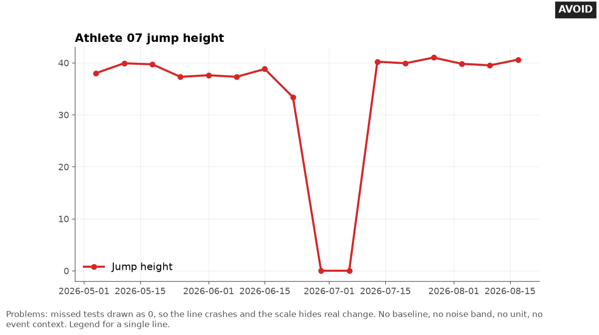

# Time series for one athlete

Last checked: 2026-10-02

## What the problem is

A coach asks whether an athlete has moved away from normal. A plain line chart cannot answer that.

Every test wobbles a little even when nothing has changed, and the line shows the wobble as if it were real. AI tools also join lines across missed tests, draw missing values as zero, and smooth the data with a rolling mean they never mention.

## Rule

Plot each athlete against that athlete's own baseline, with a shaded noise band. Leave gaps where data is missing.

Mark events with a neutral label. State every window, band, and multiplier in a note under the chart.

These rules are tool-independent. Any tool that can draw a line, a shaded band, and a text label can follow them.

### Draw the baseline

Define the baseline as the mean of `n` earlier values, taken when nothing unusual was happening. Draw it as a thin dark gray horizontal line, such as `#767676`. Say in the note which dates it covers and what `n` is.

### Draw the noise band

Shade the band around the baseline mean. Draw the band's edges as lines in `#767676` or darker, or label the edge values, because a light fill alone falls below the 3:1 contrast that the Web Content Accessibility Guidelines (WCAG) 2.2, success criterion 1.4.11, set for graphical objects. Use the same band as any flag rule in the report:

```text
noise band = baseline mean ± 1.96 × TE × √(1 + 1/n)
```

Define every term:

- `TE`: typical error, the random test-to-test variation, in the unit of the measure. Take it from a short-term test-retest study in which no true change is expected (Hopkins, 2000; Swinton et al., 2018). Hopkins (2000) says this TE suits decisions about change in an individual over any time frame.
- `n`: the number of values in the baseline mean.
- `1.96`: the multiplier for a 95 percent band. The 95 percent level is a choice that matches common MDC95 reporting (minimal detectable change at 95 percent), not a rule.

Follow these points when you build the band:

- Compute TE on the same summary as the values you plot. If you plot the best of 3 jumps, take TE from the best of 3 jumps.
- Do not use the SD of the athlete's own baseline values as TE. That SD mixes real change with error, so it is not TE.
- The `√(1 + 1/n)` term is derived by adding the variance of the new value to the variance of the baseline mean. Hopkins (2000) gives the error of a mean of `n` trials as `TE / √n`. Hopkins (2017) uses the resulting error, `TE × √(1 + 1/n)`, for a change from the mean of several tests in his monitoring spreadsheet. The 95 percent level is a choice.
- For two single tests (`n = 1`), the band is `1.96 × √2 × TE`, about `2.77 × TE` (Hopkins, 2000, section 1.1; Swinton et al., 2018). Hopkins calls this 95 percent limit too stringent for a decision limit when the person is an athlete, which is why the next point offers a lower threshold.
- When TE comes from a study of few athletes, replace 1.96 with a t value. A t value is a wider multiplier that allows for TE being estimated from a small sample. Its degrees of freedom count how much data the TE estimate rests on. Use the degrees of freedom from the TE study, not from the baseline: athletes minus 1 for two trials, or (athletes minus 1) × (trials minus 1) for the two-way model. For example, TE from 6 athletes gives t(5) = 2.57, and from 10 athletes gives t(9) = 2.26 (Swinton et al., 2018, Table 2).
- Optional practice choice: retest on separate days so normal day-to-day variation counts as noise. This gives a larger TE than a same-day retest. Label it as your choice, not a published rule.
- Offer Hopkins's practical threshold of about 1.5 to 2.0 × TE (Hopkins, 2000, section 2.1) only with its cost. For two single tests, 1.5 × TE flags 28.9 percent of pure-noise changes in either direction (14.4 percent in one direction), and 2.0 × TE flags 15.7 percent (7.9 percent), against 5 percent at 2.77 × TE. These rates are computed from the normal distribution.

Write these assumptions next to the band:

- The athlete's true value stayed the same across the baseline and the new test.
- Errors are independent from test to test.
- TE is the same for every athlete and across the range of values.
- TE is known, not estimated from a small study.

Define the band in words as: error alone gives a change smaller than this about 95 percent of the time.

### Mark points beyond the band by shape and label

Give a point outside the band a different marker shape, such as a hollow diamond, and a short text label with the value and unit. Do not rely on color alone. With every assumption met, about 5 percent of unchanged values fall outside a 95 percent band.

When the assumptions fail, the real rate can be higher or lower, so never call 5 percent a lower bound. Recommend a repeat test before anyone acts on one point, because extreme values tend to be followed by values closer to the mean (Barnett et al., 2005).

Points from consecutive weeks against the same baseline are not independent. So two flags in a row are weaker evidence than two independent flags. This follows from the shared baseline; it is derived, not taken from a paper.

### Leave gaps for missing data

Leave a gap in the line where a test is missing. Do not draw a zero. Do not join the line across the gap, because that draws a change no test measured.

Label the gap, for example `No test, 2 weeks`. This rule is practice advice.

### Say what a rolling window does

A rolling mean smooths the line and lags behind real change. Its value depends on the window length and weighting you choose.

Rolling averages weight every day in the window equally, which ignores that the effect of a session fades over time; an exponentially weighted mean is one alternative (Williams et al., 2017). Follow these points:

- State the window and type in the legend or note, for example `3-test trailing mean`.
- Use a trailing window for monitoring. A centered window uses future values that were not known on the day. This is practice advice.
- Do not compute a rolling value across a gap. Require a full window, or say how many values each point uses.
- Draw the raw points under the smoothed line, so the reader sees what was smoothed.

### Annotate events in neutral words

Mark a match, travel, a change in testing protocol, or a device change with a thin vertical line and a short label. Describe the event, not a cause: write `Two matches in 4 days`, not `Fatigue from matches`.

A protocol or device change can shift values with no change in the athlete, so mark it every time. This is practice advice.

### Align time axes across panels

When you show several measures for one athlete, stack them as separate panels with one shared time axis. Do not put them on one chart with two y-axes. Shared, aligned axes let the reader compare positions directly.

Position judgments, along a common scale or along identical but non-aligned scales, were the most accurate in Cleveland and McGill's (1986) experiment. Separate panels per series were more efficient than one shared chart for comparisons across a large visual span.

One shared chart was faster for comparisons over a small visual span. The main experiment tested 2, 4, and 8 series (Javed et al., 2010).

## Good design

The good chart shows one athlete's weekly countermovement jump (CMJ) height for 16 weeks. A light gray band with dark gray edges covers the baseline mean plus or minus 3.0 cm. A thin dark gray line marks the 38.5 cm baseline.

Blue points and a blue line show each test. The line breaks for two missed weeks, labeled `No test, 2 weeks`. A thin vertical line marks `Two matches in 4 days`.

One point at 33.4 cm sits below the band, drawn as a hollow diamond and labeled `33.4 cm, below band`. The note gives the formula, TE, `n`, the assumptions, the chance rate, and a reminder to retest.


## Bad design

The bad chart draws the two missed tests as 0 cm. The line plunges to zero and back, and the y-axis stretches from 0 to 40, so the real drop to 33.4 cm looks small.

There is no baseline, no band, no unit, and no event label. A red line and a one-item legend add nothing.



## Common mistakes

These are the mistakes AI tools make most often with athlete time series:

- Filling missing tests with 0, or joining the line across them.
- Using the SD of the athlete's own recent values as the noise.
- Shading baseline ± 1.96 × TE, which is narrower than the flag rule and makes the chart disagree with the flags.
- Using a band from a different summary than the plotted values, such as single-trial TE for best-of-3 values.
- Smoothing with a rolling mean without saying so, or with a centered window.
- Computing a rolling mean across a gap as if no days were missing.
- Including the new value in its own baseline.
- Giving each athlete's chart a different y-axis range, so a small change looks as large as a big one.
- Writing a cause in the event label.
- Putting load and jump height on one chart with two y-axes.

## Make it in Python

This matplotlib snippet draws a weekly trend with a band and gaps. It expects a file with `date` and `jump_cm` columns and tests on the same weekday each week:

```python
import numpy as np
import pandas as pd
import matplotlib.pyplot as plt

df = pd.read_csv("jumps.csv", parse_dates=["date"]).set_index("date")
df = df.asfreq("7D")                          # one row per week; a missed week becomes NaN
TE = 1.4                                      # cm, from a separate test-retest study
first = df.jump_cm.iloc[:5].dropna()          # baseline: first 5 weeks, missed weeks dropped
base, n = first.mean(), len(first)
half = 1.96 * TE * np.sqrt(1 + 1 / n)
fig, ax = plt.subplots(figsize=(8, 4))
ax.axhspan(base - half, base + half, fc="#E8E8E8", ec="#767676")  # band, 3:1 edges
ax.axhline(base, color="#767676", lw=1)                     # baseline mean
ax.plot(df.index, df.jump_cm, color="#0072B2", marker="o")  # NaN leaves a gap
ax.set_ylabel("CMJ jump height (cm)")
ax.set_title(f"Weekly jump height; band = baseline ± {half:.1f} cm (n = {n})")
fig.autofmt_xdate()
fig.savefig("trend.png", dpi=150, bbox_inches="tight")
```

The snippet is minimal. The full chart in `assets/` also adds flag markers and labels for points beyond the band, the gap label, the event line, and the note with TE, `n`, and assumptions.

For a trailing rolling mean that never spans a gap, use `df.jump_cm.rolling(3, min_periods=3).mean()`.

## Make it in other tools

Use these notes for other tools:

- **Excel:** Leave missing tests as truly empty cells. In **Select Data**, then **Hidden and Empty Cells**, set **Show empty cells as** to **Gaps**. Excel also has a **Show #N/A as an empty cell** option (Microsoft Support). Test the chart with one blank week before you trust it, because a formula that returns text such as `""` may not count as empty.
- **Any spreadsheet band:** Add two helper columns: the band's lower edge, and the band's width. Plot them as a stacked area under the line. Set the lower series to no fill and the width series to light gray with a dark gray outline. This trick is practice advice.
- **Python plotly:** Set `connectgaps=False` on the trace, and draw the band with `fig.add_hrect`.
- **R ggplot2:** An `NA` in the middle of a line breaks the line in `geom_line` (ggplot2 reference). Draw the band with `annotate("rect", ...)`.
- **Power BI:** A continuous date axis joins points across missing values. Use a categorical date axis with **Show items with no data**. Draw the band as an error band on the baseline series in the **Analytics** pane. See [bi-charts.md](bi-charts.md).
- **Tableau:** Use a calendar scaffold, and set **Special Values** to **Hide (Break Lines)** so a missing test leaves a gap. Draw a fixed band as a reference band per pane. See [bi-charts.md](bi-charts.md).

## Example request

> Plot Maya's weekly jump height since May and show me if she has dropped below her normal. We missed two weeks in July.

Status: not tested.

## Check the result

Run these checks on the chart:

- Count the line segments. Confirm the line breaks at every missing test.
- Confirm no plotted value is 0 unless the athlete scored 0.
- Recompute the band half-width from TE and `n`. Confirm it matches the shaded band and any flag rule.
- Confirm the note names the TE source, `n`, the multiplier, and the assumptions.
- Confirm every point beyond the band has a shape and a label, not only a color.
- Confirm the band has edges at 3:1 contrast or labeled edge values.
- Confirm event labels describe events and do not state causes.

## Sources

This file draws on these sources:

- Hopkins WG. Measures of reliability in sports medicine and science. *Sports Medicine*. 2000;30(1):1-15. doi:10.2165/00007256-200030010-00001. Defines typical error and supports that the error of a mean of `n` trials is `TE / √n`. Section 1.1 derives 95 percent limits of ±2.77 × TE and calls 95 percent too stringent for a decision limit for an athlete. Section 2.1, on monitoring an individual, gives a realistic threshold of about 1.5 to 2.0 × TE, with odds of a real change of 6 to 12 to 1. Section 2.2 writes the smallest worthwhile effect as 0.2 × √(S² − e²), using the between-subject SD corrected for error.
- Swinton PA, Hemingway BS, Saunders B, Gualano B, Dolan E. A statistical framework to interpret individual response to intervention: paving the way for personalized nutrition and exercise prescription. *Frontiers in Nutrition*. 2018;5:41. doi:10.3389/fnut.2018.00041. Uses typical error and confidence intervals to judge individual change, gives the `√2 × TE` change error, and tabulates t multipliers.
- Hopkins WG. A spreadsheet for monitoring an individual's changes and trend. *Sportscience*. 2017;21:5-9. https://www.sportsci.org/2017/wghtrend.htm. Accessed 2026-10-02. Its monitoring spreadsheet computes the error of a change from the mean of several reference tests as `TE × √(1 + 1/n)`, with t at the typical error's degrees of freedom.
- Barnett AG, van der Pols JC, Dobson AJ. Regression to the mean: what it is and how to deal with it. *International Journal of Epidemiology*. 2005;34(1):215-220. doi:10.1093/ije/dyh299. Explains how unusually large or small values tend to be followed by values closer to the mean.
- Williams S, West S, Cross MJ, Stokes KA. Better way to determine the acute:chronic workload ratio? *British Journal of Sports Medicine*. 2017;51(3):209-210. doi:10.1136/bjsports-2016-096589. Argues rolling averages ignore the decaying effect of training load and proposes exponentially weighted averages.
- Cleveland WS, McGill R. An experiment in graphical perception. *International Journal of Man-Machine Studies*. 1986;25(5):491-500. doi:10.1016/S0020-7373(86)80019-0. Finds the two position judgments (along a common scale and along identical but non-aligned scales) most accurate, and accuracy lower as compared marks sit further apart.
- Javed W, McDonnel B, Elmqvist N. Graphical perception of multiple time series. *IEEE Transactions on Visualization and Computer Graphics*. 2010;16(6):927-934. doi:10.1109/TVCG.2010.162. Finds separate charts per series, such as small multiples, more efficient for comparisons across a large visual span, and one shared chart faster over a small visual span. Tested 2, 4, and 8 series in the main experiment.
- Microsoft Support. Display empty cells, null (#N/A) values, and hidden worksheet data in a chart. https://support.microsoft.com/en-us/office/display-empty-cells-null-n-a-values-and--worksheet-data-in-a-chart-a1ee6f0c-192f-4248-abeb-9ca49cb92274. Accessed 2026-10-02.
- W3C. Web Content Accessibility Guidelines (WCAG) 2.2. W3C Recommendation, 2024-12-12. https://www.w3.org/TR/WCAG22/. Success criterion 1.4.11, non-text contrast of 3:1.
- ggplot2 reference. Connect observations: `geom_path`, `geom_line`, `geom_step`. https://ggplot2.tidyverse.org/reference/geom_path.html. Accessed 2026-10-02.
