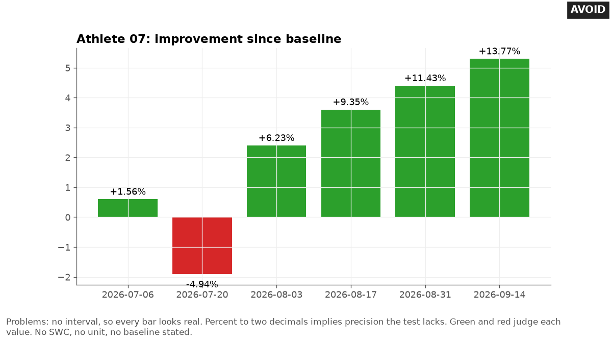

# Noise and uncertainty

Last checked: 2026-10-02

## What the problem is

Every athlete measure carries noise. A chart that shows a value with no interval tells the reader it is exact.

AI tools add error bars without saying what they are, pick the standard error of the mean because it is small, and print changes to two decimals. Readers then act on differences the test cannot detect.

## Rule

Show the uncertainty that matches the question, and say in words what it is. Use the standard deviation for spread between athletes. Use an interval or a noise band for a change.

Shade the smallest worthwhile change as a zone. Round values to the precision the test supports.

These rules are tool-independent. Every charting tool can draw an interval line and a shaded zone.

### Label every error bar

Error bars may show a confidence interval, a standard error, a standard deviation, or something else. Each gives different information, so the caption must say which one the bars show (Cumming et al., 2007).

Researchers in a large web study often confused confidence intervals with standard error bars, and did not allow for whether two means were independent or repeated measures (Belia et al., 2005). Write the type and the multiplier, for example `bars: 95% interval for the change`.

### Use the SD for spread, not the SEM

The standard deviation (SD) describes how far athletes sit from each other. The standard error of the mean (SEM) describes how precisely a mean is estimated, and it shrinks as the squad grows.

Hopkins and colleagues (2009) advise showing the SD and never showing standard errors of means, because the SEM depends on sample size. Show the SD when the reader needs to judge how athletes differ.

### Show the changes for paired data

When the same athletes are tested twice, error bars on each mean say nothing about each athlete's change. Plot the individual changes, or the paired points joined by lines. Belia and colleagues (2005) found that readers do not allow for repeated measures when they read error bars on two means.

### Prefer intervals and points to bars with error bars

The way a chart encodes a mean and its error changes the decisions people make from it (Correll and Gleicher, 2014). Bars also make values inside the bar look more likely than values outside it (Newman and Scholl, 2012).

For a mean or a change with an interval, draw a point with an interval line; this is practice advice. Correll and Gleicher (2014) suggest gradient plots and violin plots as better choices than bars with error bars for inferential tasks.

### Draw the noise band and the change interval with the same formula

For a change from an athlete's baseline mean, use this interval. It has the same half-width as the noise band in [time-series.md](time-series.md):

```text
change interval = change ± 1.96 × TE × √(1 + 1/n)
```

`TE` is the typical error, the random test-to-test variation, from a short-term test-retest study in which no true change is expected (Hopkins, 2000; Swinton et al., 2018). A test-retest study tests the same athletes twice over a short gap. `n` is the number of values in the baseline mean.

The 95 percent level is a choice that matches common MDC95 reporting (minimal detectable change at 95 percent), not a rule. The `√(1 + 1/n)` term adds the variance of the new value to the variance of the baseline mean. Hopkins (2017) uses the same error for a change from the mean of several tests. For two single tests, use `1.96 × √2 × TE`, about `2.77 × TE` (Swinton et al., 2018).

When TE comes from few athletes, replace 1.96 with a t value, a wider multiplier for a TE estimated from a small sample. Use the degrees of freedom of the TE study, for example t(5) = 2.57 for 6 athletes tested twice. List the assumptions under the chart: constant true score, independent errors, the same TE for all athletes and values, and TE known.

See [time-series.md](time-series.md) for the full band rules.

### Shade the smallest worthwhile change as a zone

The smallest worthwhile change (SWC) is the smallest change that matters in practice. Shade it as a light gray zone from minus SWC to plus SWC around zero change.

Give the zone edges in `#767676` or darker, or label the edge values, so it meets the 3:1 contrast of the Web Content Accessibility Guidelines (WCAG) 2.2, success criterion 1.4.11. The common default is a convention, based on 0.2 as the threshold for a small standardized difference (Hopkins et al., 2009):

```text
SWC = 0.2 × between-athlete SD
```

State these caveats with it:

- It depends on how similar the squad is. A tight squad gives a small SWC.
- It is imprecise in a small squad.
- Use the uncorrected between-athlete SD by default (Swinton et al., 2018). The example below does: `0.2 × 4.8 = 1.0 cm`.
- Optional: the between-athlete SD includes measurement error, so Hopkins (2000, section 2.2) writes the smallest worthwhile effect with the corrected SD, `0.2 × √(SD² − TE²)`. In the example that gives 0.9 cm. Say which version you used.
- For competition performance, Hopkins and colleagues (2009) give thresholds of 0.3, 0.9, 1.6, 2.5, and 4.0 times the within-athlete variation between competitions, not the 0.2 SD scale.

Read each change against both the noise band and the SWC zone:

| Reading | Rule | Plain words |
|---|---|---|
| Within noise band | The interval crosses zero | `not larger than measurement error` |
| Larger than measurement error | The interval excludes zero but overlaps the SWC zone | `larger than measurement error; may or may not be worthwhile` |
| Clearly beyond SWC | The whole interval lies beyond the SWC in the chosen direction | `clearly beyond the smallest worthwhile change` |

The last row follows Swinton and colleagues (2018). Use a different marker shape for each reading, and print the reading in words next to the point.

### Round to the precision the data supports

Round values to the precision the test supports. A jump test with a TE of 1.4 cm does not support `+5.43%`. One decimal place in cm is enough.

This is practice advice. Also follow these points:

- Show raw values and units next to any percent change.
- Do not draw a fitted line or a forecast past the last data point.
- Do not show a single number for a squad score when the parts disagree. Show the parts.
- When you flag athletes in a squad, print the number of flags expected by chance next to the number found. See [squad-views.md](squad-views.md) for the count. With all assumptions met, about 5 percent of pure-noise changes fall outside a 95 percent band in either direction, or 2.5 percent in one direction. When assumptions fail, the real rate can be higher or lower, so never call 5 percent a lower bound.

## Good design

The good chart shows one athlete's change in countermovement jump (CMJ) height from baseline at six tests, one row per date. Each row has a point and a horizontal 95 percent interval of plus or minus 3.0 cm. A light gray zone with dark gray edges marks plus or minus 1.0 cm, labeled `Smaller than SWC`.

Hollow circles mark changes inside the noise band, a filled circle marks a change larger than measurement error, and filled diamonds mark changes clearly beyond the SWC. Each row ends with the change in cm and its reading in words. The note gives TE, `n`, the SWC formula, and its caveats.


## Bad design

The bad chart shows the same six changes as bars with no interval. Green bars mark gains and a red bar marks the loss. Each bar carries a percent to two decimals, such as `+13.77%`.

The title says `improvement`. Nothing tells the reader that the first three changes sit inside the noise.



## Common mistakes

These are the mistakes AI tools make most often with uncertainty:

- Adding error bars without saying whether they show SD, SEM, or an interval.
- Using SEM to make spread look small.
- Putting error bars on two means from the same athletes and reading overlap as no change.
- Using the SD of an athlete's own recent values as TE.
- Drawing the noise band with `1.96 × TE` and no `√(1 + 1/n)` term.
- Calling a change worthwhile because it passed the noise band, with no check of the SWC.
- Calling a change clearly worthwhile when only the point, not the whole interval, lies beyond the SWC.
- Printing percent changes to two decimals.
- Coloring changes green and red by sign.

## Make it in Python

This matplotlib snippet draws changes with intervals and the SWC zone:

```python
import numpy as np
import matplotlib.pyplot as plt

dates = ["2026-07-06", "2026-07-20", "2026-08-03", "2026-08-17", "2026-08-31", "2026-09-14"]
change = np.array([0.6, -1.9, 2.4, 3.6, 4.4, 5.3])     # cm, change from baseline mean
TE, n, sd = 1.4, 5, 4.8                                # cm; sd = squad SD on the test
half = 1.96 * TE * np.sqrt(1 + 1 / n)
swc = 0.2 * sd                                         # default; option: 0.2 * sqrt(sd**2 - TE**2)
fig, ax = plt.subplots(figsize=(7, 4))
ax.axvspan(-swc, swc, fc="#E8E8E8", ec="#767676", label=f"Smaller than SWC (± {swc:.1f} cm)")
ax.errorbar(change, range(len(dates)), xerr=half, fmt="o", color="#0072B2", capsize=0)
ax.axvline(0, color="#767676", lw=1)
ax.set_yticks(range(len(dates)), dates)
ax.invert_yaxis()
ax.set_xlabel(f"Change from baseline (cm); bars: 95% interval, ± {half:.1f} cm")
ax.legend(loc="lower left", bbox_to_anchor=(0, 1), frameon=False)
fig.savefig("change_intervals.png", dpi=150, bbox_inches="tight")
```

The snippet is minimal. The full chart in `assets/` also adds a marker shape and a printed reading for each row, and the note with TE, `n`, and the SWC caveats.

## Make it in other tools

Use these notes for other tools:

- **Excel:** Select the series, then **Add Chart Element**, **More Error Bars Options**. Under **Error Amount**, choose **Custom**, then **Specify Value**, and point to a column of interval half-widths (Microsoft Support). Do not use the built-in **Standard Error** or **Standard Deviation** options for an individual change. They do not use your TE.
- **Any spreadsheet SWC zone:** Add a stacked area or a wide bar from minus SWC to plus SWC behind the points, filled light gray with a dark gray outline. This trick is practice advice.
- **Python plotly:** Use `error_x=dict(type="data", array=...)` on a scatter trace, and `fig.add_vrect` for the SWC zone.
- **R ggplot2:** Use `geom_pointrange()` with the change on the x-axis and `xmin` and `xmax` for the interval, and `annotate("rect", ...)` for the SWC zone.
- **Power BI:** Error bars attach to line, bar, column, and combo charts, not scatter charts. Use a line chart with markers only, and set the bounds to your lower and upper measures. Do not use a built-in standard deviation option for an individual change. See [bi-charts.md](bi-charts.md).
- **Tableau:** Draw the interval as a Gantt bar on a synchronized dual axis, and the SWC zone as a reference band. See [bi-charts.md](bi-charts.md).

## Example request

> Show me whether Jordan's jump height change since preseason is real or just noise. Our CMJ typical error is 1.4 cm and squad SD is 4.8 cm.

## Check the result

Run these checks on the chart:

- Read the caption. Confirm it says what every error bar or band shows, with the multiplier.
- Confirm spread between athletes uses SD, not SEM.
- Recompute one interval from TE and `n`. Confirm it matches the chart.
- Confirm the SWC zone uses the stated formula, says whether the SD is corrected, and the caveats appear in the note.
- Confirm bands and zones have edges at 3:1 contrast or labeled edge values.
- Confirm every `clearly beyond SWC` label has its whole interval past the SWC.
- Confirm no value shows more decimals than the test supports.

## Sources

This file draws on these sources:

- Cumming G, Fidler F, Vaux DL. Error bars in experimental biology. *Journal of Cell Biology*. 2007;177(1):7-11. doi:10.1083/jcb.200611141. States that error bars may show confidence intervals, standard errors, or standard deviations, that each gives different information, and that figure legends must say which.
- Belia S, Fidler F, Williams J, Cumming G. Researchers misunderstand confidence intervals and standard error bars. *Psychological Methods*. 2005;10(4):389-396. doi:10.1037/1082-989X.10.4.389. Finds many researchers do not distinguish confidence intervals from standard error bars and do not allow for repeated measures designs.
- Hopkins WG, Marshall SW, Batterham AM, Hanin J. Progressive statistics for studies in sports medicine and exercise science. *Medicine and Science in Sports and Exercise*. 2009;41(1):3-13. doi:10.1249/MSS.0b013e31818cb278. Advises showing the SD and never the SEM, translates correlation thresholds into 0.2, 0.6, 1.2, 2.0, and 4.0 for standardized differences in means, and gives thresholds of 0.3, 0.9, 1.6, 2.5, and 4.0 of within-athlete variation for competition performance.
- Correll M, Gleicher M. Error bars considered harmful: exploring alternate encodings for mean and error. *IEEE Transactions on Visualization and Computer Graphics*. 2014;20(12):2142-2151. doi:10.1109/TVCG.2014.2346298. Finds the encoding of mean and error changes viewers' decisions, and suggests gradient and violin plots over bars with error bars.
- Newman GE, Scholl BJ. Bar graphs depicting averages are perceptually misinterpreted: the within-the-bar bias. *Psychonomic Bulletin and Review*. 2012;19(4):601-607. doi:10.3758/s13423-012-0247-5. Finds viewers judge points inside a bar as more likely than points equally far outside it.
- Hopkins WG. Measures of reliability in sports medicine and science. *Sports Medicine*. 2000;30(1):1-15. doi:10.2165/00007256-200030010-00001. Defines typical error and the error of a mean of `n` trials. Section 2.2 writes the smallest worthwhile effect as 0.2 of the between-subject SD corrected for error, `0.2 × √(S² − e²)`.
- Swinton PA, Hemingway BS, Saunders B, Gualano B, Dolan E. A statistical framework to interpret individual response to intervention: paving the way for personalized nutrition and exercise prescription. *Frontiers in Nutrition*. 2018;5:41. doi:10.3389/fnut.2018.00041. Combines confidence intervals with the smallest worthwhile change, defined from the between-athlete SD, to judge individual change.
- Hopkins WG. A spreadsheet for monitoring an individual's changes and trend. *Sportscience*. 2017;21:5-9. https://www.sportsci.org/2017/wghtrend.htm. Accessed 2026-10-02. Its monitoring spreadsheet computes the error of a change from the mean of several reference tests as `TE × √(1 + 1/n)`, with t at the typical error's degrees of freedom.
- W3C. Web Content Accessibility Guidelines (WCAG) 2.2. W3C Recommendation, 2024-12-12. https://www.w3.org/TR/WCAG22/. Success criterion 1.4.11, non-text contrast of 3:1.
- Microsoft Support. Add, change, or remove error bars in a chart. https://support.microsoft.com/en-us/office/add-change-or-remove-error-bars-in-a-chart-e6d12c87-8533-4cd6-a3f5-864049a145f0. Accessed 2026-10-02.
